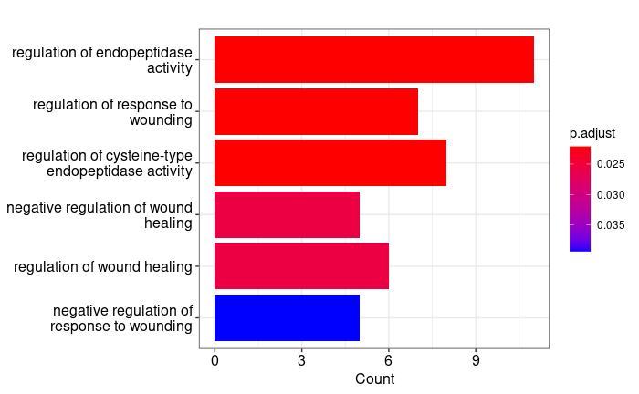
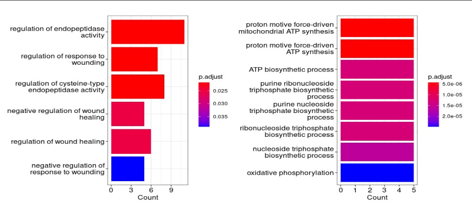

<<<<<<< HEAD
# Objetivo: 

Realizar el análisis de datos de RNA-Seq (pipeline completa) obtenidos de un trofoblasto humano. ***COMPLETAR CON LA LECTURA DEL PAPER

--------------------------------------------------------------------------------

# Descripcion de los datos

- Tipo de bibliotecas: Paired-end

- Método de selección: ARN Total, cDNA **** PREGUNTA A EVELIA: ¿es necesario escribir cDNA?

- Número de transcriptomas: 6 transcriptomas 

- Número de réplicas biológicas: 3 con un total de 11 corridas *** PREGUNTA A EVELIA: Las muestras las obtuvimos de NCBI y son 6. Cabe destacar que la muestra #4 tiene 2 corridas, la #5 y #6 tienen 3 corridas, así que el número real de archivos que vamos a descargar en el cluster son 11.

- Secuenciador: Illumina NovaSeq 6000

- Distribución de las muestras: 

  Control: tratamiento con DMSO (hTSC, DMSO) - SRR18745765 (repbio1), SRR18745766 (repbio1), SRR18745770 (repbio2), SRR18745771 (repbio2), SRR18745772 (repbio2), SRR18745767 (repbio3), SRR18745768 (repbio3), SRR18745769 (repbio3) 

  Tratamiento con SP600125 (hTSC, SP600125) - SRR18745764 (repbio1), SRR18745763 (repbio2) y SRR18745762 (repbio3)

- Profundidad de secuenciación de cada transcriptoma: ***** 

--------------------------------------------------------------------------------

# Abstract

¿Qué comparamos?

¿Qué tipo de datos analizaste? RNA-seq

¿Qué programas usaste y por qué? Kllisto quant, FastQC, trimm... 

Información breve de que obtuviste

Máximo 200 palabras

--------------------------------------------------------------------------------

# Rutas de trabajo generadas en el proyecto

0. Carpeta de trabajo del equipo 

```{bash, eval = FALSE}
cd /mnt/Timina/bioinfoII/rnaseq/BioProject_2023/rawData/Homo_sapiens 
```

1. Contiene los nombres de los SRA

```{bash, eval=FALSE}
cd /mnt/Timina/bioinfoII/rnaseq/BioProject_2023/rawData/Homo_sapiens/human_fastq.txt
```

2. Contiene las instrucciones de descarga de los datos (SRA) y el cambio a Fastq de los mismos.

```{bash, eval = FALSE}
cd /mnt/Timina/bioinfoII/rnaseq/BioProject_2023/rawData/Homo_sapiens/SRAData_dow.sh
```

3. Contiene el JOB de descarga de los SRA

```{bash, eval = FALSE}
cd /mnt/Timina/bioinfoII/rnaseq/BioProject_2023/rawData/Homo_sapiens/SRA_run.sge
```

4. Contiene los datos crudos y sus fastqc.gz que se enviaron a la carpeta FastQC_rawData para su análisis.

```{bash, eval = FALSE}
cd /mnt/Timina/bioinfoII/rnaseq/BioProject_2023/rawData/Homo_sapiens/data
```

5. Contiene el análisis de calidad de los datos crudos

```{bash, eval = FALSE}
cd /mnt/Timina/bioinfoII/rnaseq/BioProject_2023/rawData/Homo_sapiens/FastQC_rawData
```

6. Contiene el JOB para recortar y curar datos de Illumina, como eliminar adaptadores de los datos crudos

```{bash, eval = FALSE}
cd /mnt/Timina/bioinfoII/rnaseq/BioProject_2023/rawData/Homo_sapiens/Trimmed_run.sge
```

#7. Contiene los adaptadores para paired-end *****NO ESTOY SEGURA, VIVALDO LO PUSO. CHECAR.

```{bash, eval = FALSE}
cd /mnt/Timina/bioinfoII/rnaseq/BioProject_2023/rawData/Homo_sapiens/TruSeq3-PE.fa
```

8. Contiene los datos (SRA) sin adaptadores (limpios) y sus fastqc.gz que se enviaron a la carpeta FastQC_trimmed para su análisis

```{bash, eval = FALSE}
cd /mnt/Timina/bioinfoII/rnaseq/BioProject_2023/rawData/Homo_sapiens/data_trimmed
```

9. Contiene el análisis de calidad de los datos limpios, sin adaptadores.

```{bash, eval = FALSE}
cd /mnt/Timina/bioinfoII/rnaseq/BioProject_2023/rawData/Homo_sapiens/FastQC_trimmed
```

9.1. Contiene el análisis MultiQC de datos sin adaptadores.

```{bash, eval = FALSE}
cd /mnt/Timina/bioinfoII/rnaseq/BioProject_2023/rawData/Homo_sapiens/FastQC_trimmed/multiqc_report.html
```

10. 

```{bash, eval = FALSE}
cd 
```

--------------------------------------------------------------------------------

# Resultados y discusión 


#Comandos de descarga del Vivaldo. SE OCUPAN + TARDE. **********************

```{bash, eval = FALSE}
# Descargar analisis FastQC --> computadora
rsync -rptuvl mrivera@dna.lavis.unam.mx:/mnt/Timina/bioinfoII/rnaseq/BioProject_2023/rawData/Homo_sapiens/FastQC_rawData ./Documents

# Descargar analisis FastQC --> computadora
rsync -rptuvl mrivera@dna.lavis.unam.mx:/mnt/Timina/bioinfoII/rnaseq/BioProject_2023/rawData/Homo_sapiens/FastQC_rawData ./Documents

#Contiene el análisis MultiQC de datos sin adaptadores.este archivo es descargable para analizar. multiqc
cd /mnt/Timina/bioinfoII/rnaseq/BioProject_2023/rawData/Homo_sapiens/FastQC_trimmed/multiqc_report.html
```


## Calidad de secuencias (FastQC y multiQC) de datos crudos.

Auí van las imagenes que quiero poner. 

# Analisis MultiQC rawdata

- Todas son de 150 bp.

- El SRA que tiene mas secuenciaciones es 'SRR18745762' con $66.1 \space Millones$. El SRA con menos secuencias fue 'SRR18745771' con $3 \space Millones$.

- El SRA 'SRR18745762' tiene $75.6 \% $ de duplicados. Si bien esto podría suponer un problema, debemos recordar que trabajamos con RNA-seq y los duplicados se puede deber a la expresion de un pequeño numero de genes. En RRna-seq no deben de eliminarse los duplicados, a menos que tengan UMIs(barcodes).

- Esta grafica nos muestra que todos los archivos tuvieron una buena calidad. Siendo la muestra 'SRR18745771_1' la que tiene la calidad mas baja de $24.53$, es decir, el error esta entre $0.01<error<.001$

- https://dnatech.genomecenter.ucdavis.edu/faqs/should-i-remove-pcr-duplicates-from-my-rna-seq-data/
- https://www.biostars.org/p/14283/ 

## Per Sequence GC Content 

- Solamente 2 muestras salieron bien, el resto tuvieron alertas (11) o fueron marcadas como errores (9). Esto es normal, ya que las primeras 10-12 bases son resultado del hexamero utilizado como primers, este hexamero esta compuesto de forma aleatoria.

- https://hbctraining.github.io/Intro-to-rnaseq-hpc-salmon/lessons/qc_fastqc_assessment.html#:~:text=The%20%E2%80%9CPer%20sequence%20GC%20content,expected%20%25%20GC%20for%20the%20organism.

## Per Base N Content 

- Todas las muestras pasaron la prueba, esto indica que todas las posiciones tienen asignadas una base.

- https://rtsf.natsci.msu.edu/sites/_rtsf/assets/File/FastQC_TutorialAndFAQ_080717.pdf

## Overrepresented sequence

- Es posible que la sobrerepresentacion de las secuencias se deban a que un transcriptoma es muy abundante.

- https://rtsf.natsci.msu.edu/genomics/tech-notes/fastqc-tutorial-and-faq/#:~:text=Overrepresented%20Sequences,to%20try%20to%20identify%20it.

## Adapter Content 

- Solamente 2 muestras tienen alerta 'SRR18745771_1 y SRR18745768_1' esto ocurre debido a que el adaptador esta presente en mas del $5 \% $ de las lecturas. El resto de las muestras tienen errores, esto indica que el adaptador esta presente en mas del $10 \% $ de las lecturas.

- https://www.ridom.de/seqsphere/u/FASTQ_Quality_Control_(FastQC).html

Realizar el análisis de datos de RNA-Seq (pipeline completa) obtenidos de trofoblasto humano. ***COMPLETAR CON LA LECTURA DEL PAPER


--------------------------------------------------------------------------------
# Analisis MultiQC sin adaptadores


--------------------------------------------------------------------------------
# Kallisto pseudo alligment

- Descargar transcriptoma de referencia
```{bash, eval = FALSE}
# Generar transcriptoma de referencia meaidnte el JOB 'Transcript_down.sge', con las instrucciones:
wget https://ftp.ebi.ac.uk/pub/databases/gencode/Gencode_human/release_43/gencode.v43.transcripts.fa.gz 

# Ubicacion transciptoma de referencia
cd /mnt/Timina/bioinfoII/rnaseq/BioProject_2023/rawData/Homo_sapiens/gencode.v43.transcripts.fa.gz

# Carpeta de archivos kallisto
mkdir kallisto_quant_test
```

- Generar un JOB 'Kallisto_down_data.sge'.
```{bash, eval = FALSE}
#!/bin/bash
#
# Use Current working directory
#$ -cwd
#
# Join stdout and stderr
#$ -j n
#
# Run job through bash shell
#$ -S /bin/bash
#
# You can edit the script since this line
#
# Your job name
#$ -N Kallisto_down_data
#
# Send an email after the job has finished
#$ -m e
#$ -M rivera20c3@gmail.com
#
#
# If modules are needed, source modules environment (Do not delete the next line):
. /etc/profile.d/modules.sh
#
# Add any modules you might require:
module load kallisto/0.45.0
#
# Write your commands in the next line

# Generar index de kallisto
kallisto index ./gencode.v43.transcripts.fa.gz -i ./kallisto_quant_test/HS_ref.kidx 

# - i nombre del archivo de salida, i.e., indice
#- Input =  gencode.v43.transcripts.fa.gz, transcriptoma de referencia

 # Paired-end  
for file in ./data_trimmed/*_1_trimmed.fastq.gz                                                 # Read1
do
  clean=$(echo $file | sed 's/_trimmed//;s/\.fastq\.gz//;s/_1//')         # Nombre de la carpeta de salida, mismo nombre de SRA
  file_2=$(echo ${clean}_2_trimmed.fastq.gz| sed 's/FP/RP/')                                            # Read2
  kallisto quant --index ./kallisto_quant_test/HS_ref.kidx --output-dir ./kallisto_quant_test/${clean} --threads 12 ${file} ${file_2}
done
```


- Mostrar resultados del alineamiento
```{bash, eval = FALSE}

# JOB 'Kallisto_down_data.sge' para generar el alineamiento
cd ./Kallisto_down_data.sge

# Se encuentran en el archivo de errores del JOB
cat Kallisto_down_data.e276381 
```


--------------------------------------------------------------------------------
# Descripcion de los datos

- Tipo de bibliotecas: Paired-end

- Método de selección: ARN Total, cDNA ****************** PREGUNTA A EVELIA: cDNA ¿es complementary DNA?

- Número de transcriptomas: 6 transcriptomas 

- Número de réplicas biológicas: 3 con un total de 11 corridas ***************** PREGUNTA A EVELIA: Las muestras las obtuvimos de NCBI y son 6. Cabe destacar que la muestra #4 tiene 2 corridas, la #5 y #6 tienen 3 corridas, así que el número real de archivos que vamos a descargar en el cluster son 11.

- Secuenciador: Illumina NovaSeq 6000

- Distribución de las muestras: 

  Control: tratamiento con DMSO (hTSC, DMSO) - SRR18745765 (repbio1), SRR18745766 (repbio1), SRR18745770 (repbio2), SRR18745771 (repbio2), SRR18745772 (repbio2), SRR18745767 (repbio3), SRR18745768 (repbio3), SRR18745769 (repbio3) 

  Tratamiento con SP600125 (hTSC, SP600125) - SRR18745764 (repbio1), SRR18745763 (repbio2) y SRR18745762 (repbio3)

- Profundidad de secuenciación de cada transcriptoma: ************************** PREGUNTA ¿DÓNDE VEO ESTO? 

--------------------------------------------------------------------------------

# Abstract

¿Qué comparamos?

¿Qué tipo de datos analizaste? RNA-seq

¿Qué programas usaste y por qué? Kllisto quant, FastQC, trimm... 

Información breve de que obtuviste

Máximo 200 palabras

--------------------------------------------------------------------------------

# Rutas de trabajo generadas en el proyecto

0. Carpeta de trabajo del equipo 

```{bash, eval = FALSE}
cd /mnt/Timina/bioinfoII/rnaseq/BioProject_2023/rawData/Homo_sapiens 
```

1. Contiene los nombres de los SRA

```{bash, eval = FALSE}
cat /mnt/Timina/bioinfoII/rnaseq/BioProject_2023/rawData/Homo_sapiens/human_fastq.txt
```

2. Contiene las instrucciones de descarga de los datos (SRA) y el cambio a Fastq de los mismos.

```{bash, eval = FALSE}
cat /mnt/Timina/bioinfoII/rnaseq/BioProject_2023/rawData/Homo_sapiens/SRAData_dow.sh
```

3. Contiene el JOB de descarga de los SRA

```{bash, eval = FALSE}
cat /mnt/Timina/bioinfoII/rnaseq/BioProject_2023/rawData/Homo_sapiens/SRA_run.sge
```

4. Contiene los datos crudos y sus fastqc.gz que se enviaron a la carpeta FastQC_rawData para su análisis.

```{bash, eval = FALSE}
cd /mnt/Timina/bioinfoII/rnaseq/BioProject_2023/rawData/Homo_sapiens/data
```

5. Contiene el análisis de calidad fastqc de los datos crudos

```{bash, eval = FALSE}
cd /mnt/Timina/bioinfoII/rnaseq/BioProject_2023/rawData/Homo_sapiens/FastQC_rawData
```


6. Contiene el JOB para realizar la limpieza de adaptadores **** MANUEL Contiene el JOB generado para realizar el análisis de calidad de la 'rawdata'

```{bash, eval = FALSE}

 /mnt/Timina/bioinfoII/rnaseq/BioProject_2023/rawData/Homo_sapiens/Trimmed_run.sge
```

7. Contiene los adaptadores para paired-end *****NO ESTOY SEGURA, VIVALDO LO PUSO. CHECAR.
```{bash, eval = FALSE}
cat /mnt/Timina/bioinfoII/rnaseq/BioProject_2023/rawData/Homo_sapiens/Trimmed_run.sge
```

7. Contiene los adaptadores para paired-end


```{bash, eval = FALSE}
cat /mnt/Timina/bioinfoII/rnaseq/BioProject_2023/rawData/Homo_sapiens/TruSeq3-PE.fa
```

7. Contiene las muestras (SRA) sin adaptadores

```{bash, eval = FALSE}
cd /mnt/Timina/bioinfoII/rnaseq/BioProject_2023/rawData/Homo_sapiens/data_trimmed
```

8. Contiene el analisis MultiQC de datos sin adaptadores

```{bash, eval = FALSE}
cat /mnt/Timina/bioinfoII/rnaseq/BioProject_2023/rawData/Homo_sapiens/FastQC_trimmed/multiqc_report.html
```

10. Contiene el transcriptoma de referencia humano

```{bash, eval = FALSE}
/mnt/Timina/bioinfoII/rnaseq/BioProject_2023/rawData/Homo_sapiens/gencode.v43.transcripts.fa.gz
```

11. Contiene el JOB para hacer uso de Kallisto quant 

```{bash, eval = FALSE}
cat /mnt/Timina/bioinfoII/rnaseq/BioProject_2023/rawData/Homo_sapiens/Kallisto_down_data.sge
```

12. Contiene el JOB para descagar el transcriptoma de referencia humano.

```{bash, eval = FALSE}
cat /mnt/Timina/bioinfoII/rnaseq/BioProject_2023/rawData/Homo_sapiens/Transcript_down.sge
```

13. Contiene el pseudoalineamiento generado con el uso de la herramienta Kallisto

```{bash, eval = FALSE}
cd /mnt/Timina/bioinfoII/rnaseq/BioProject_2023/rawData/Homo_sapiens/kallisto_quant_test
```

## Códigos previos antes de iniciar el análisis

Antes de comenzar todo el proyecto, dentro del cluster guardamos una sesión en screen con la finalidad de poder tener un registro de los comando utilizados durante la práctica 

```{bash}
# Trabajando en el nodo principal generamos un screen
screen -S SRAdata
# Ingresar a un nodo de computo 
qlogin 
```

- screen -S nombre : Guardar tu sesión actual 
- screen -ls : Ver el ID de tus sesiones 
- screen -ls : Ver el ID de tus sesiones 
- Ctrl + a + d : Salir del screen
- Ctrl + a + esc : scroll

```{bash}
# Ingresar a la carpeta de trabajo 
cd /mnt/Timina/bioinfoII/rnaseq/BioProject_2023/rawData/Homo_sapiens 
# Crear una carpeta donde colocaremos los SRA correspondientes a nuestro proyecto que descargaremos de NCBI con ayuda de un JOB 
mkdir data
# Generar un JOB el cual tiene las instrucciones para descargar los SRA del proyecto
nano SRA_run.sge
# Archivo txt que contiene todos los SRA a descargar
nano human_fastq.txt
```

El contenido del nano `human_fastq.txt` es el siguiente

```{bash}
cat human_fastq.txt # Abrir archivo txt 
```

SRR18745762
SRR18745763
SRR18745764	
SRR18745765	
SRR18745766
SRR18745767	
SRR18745768	
SRR18745769	
SRR18745770
SRR18745771
SRR18745772

Por otra parte, el contenido del nano `SRA_run.sge` es el siguiente

```{bash}
cat SRA_run.sge # Abrir archivo JOB con instrucciones de descarga
```

```{bash}
#!/bin/bash
#
# Use Current working directory
#$ -cwd
#
# Join stdout and stderr
#$ -j n
#
# Run job through bash shell
#$ -S /bin/bash
#
# You can edit the script since this line
#
# Your job name
#$ -N Project_Homo
#
# Send an email after the job has finished
#$ -m Manuel
#$ -M rivera20c3@gmail.com
#
#
# If modules are needed, source modules environment (Do not delete the next line):
. /etc/profile.d/modules.sh
#
# Add any modules you might require:
module load sra/3.0.0 # módulo para descagar SRA
#
# Write your commands in the next line
./SRAData_dow.sh

```

Finalmente para enviar el JOB de descarga y tener las muestras a trabajar usamos el siguiente comando

```{bash}
# Salir de qlogin, moverse a nodo principal para subir JOB
qsub SRA_Hs_run.sge
```

--------------------------------------------------------------------------------

# Resultados y discusión 


## Calidad de secuencias (FastQC y multiQC) de datos crudos.

Primeramente, para analizar los datos crudos creamos dos carpetas. La primera, `data` en donde vamos a almacenar los datos crudos y la segunda, `FastQC_rawData` en donde vamos a tener el análisis de calidad de los mismos. 

<<<<<<< HEAD
```{bash}
=======

```{bash, eval = FALSE}
>>>>>>> 65067f72925dd5e8f40d776f01e07af01ef1a9e8
# Colocarse en la carpeta de trabajo
cd /mnt/Timina/bioinfoII/rnaseq/BioProject_2023/rawData/Homo_sapiens

# Crear carpetas
mkdir data
mkdir FastQC_rawData
```

Posteriormente, vamos a iniciar el análisis de calidad de las lecturas crudas o sin procesar (raw data)

```{bash, eval = FALSE}

# cargar module FastQC
qlogin
module load fastqc/0.11.3

# Crear fastqc por lectura
fastqc ./data/*.fastq.gz -o ./FastQC_rawData

```

`fastqc ./data/*.fastq.gz -o ./FastQC_rawData` indica que realice un fastqc a todos los archivos contenidos en la carpeta data que terminen con .fastq.gz y que los outputs los ponga en la carpeta FastQC_rawData.


# Resultados y discusión 
=======
Ahora bien, se utiliza la herrmaienta MultiQC, la cual crea un único informe con gráficos interactivos para múltiples análisis bioinformáticos en muchas muestras. Se corre el siguiente código.

```{bash, eval = FALSE}
# Cargar modulo
module load multiqc/1.5
# Generar reporte multiqc
multiqc ./FastQC_rawData -o ./FastQC_rawData
```

Para poder visualizar el informe multiqc,  se descarga el archivo a nuestro ordenador con el siguiente comando:

```{bash, eval = FALSE}
rsync -rptuvl jgarcia@dna.lavis.unam.mx:/mnt/Timina/bioinfoII/rnaseq/BioProject_2023/rawData/Homo_sapiens/FastQC_rawData/multiqc_report.html .
```

Podemos observar que...


- Todas son de 150 bp.

- El SRA que tiene mas secuenciaciones es 'SRR18745762' con $66.1 \space Millones$. El SRA con menos secuencias fue 'SRR18745771' con $3 \space Millones$.

- El SRA 'SRR18745762' tiene $75.6 \% $ de duplicados. Si bien esto podría suponer un problema, debemos recordar que trabajamos con RNA-seq y los duplicados se puede deber a la expresion de un pequeño numero de genes. En RRna-seq no deben de eliminarse los duplicados, a menos que tengan UMIs(barcodes).

- Esta grafica nos muestra que todos los archivos tuvieron una buena calidad. Siendo la muestra 'SRR18745771_1' la que tiene la calidad mas baja de $24.53$, es decir, el error esta entre $0.01<error<.001$

- https://dnatech.genomecenter.ucdavis.edu/faqs/should-i-remove-pcr-duplicates-from-my-rna-seq-data/
- https://www.biostars.org/p/14283/ 

Ahora bien, hablo de Per Sequence GC Content 

- Solamente 2 muestras salieron bien, el resto tuvieron alertas (11) o fueron marcadas como errores (9). Esto es normal, ya que las primeras 10-12 bases son resultado del hexamero utilizado como primers, este hexamero esta compuesto de forma aleatoria.

- https://hbctraining.github.io/Intro-to-rnaseq-hpc-salmon/lessons/qc_fastqc_assessment.html#:~:text=The%20%E2%80%9CPer%20sequence%20GC%20content,expected%20%25%20GC%20for%20the%20organism.

y de Per Base N Content 

- Todas las muestras pasaron la prueba, esto indica que todas las posiciones tienen asignadas una base.

- https://rtsf.natsci.msu.edu/sites/_rtsf/assets/File/FastQC_TutorialAndFAQ_080717.pdf

Sobre Overrepresented sequence

- Es posible que la sobrerepresentacion de las secuencias se deban a que un transcriptoma es muy abundante.

- https://rtsf.natsci.msu.edu/genomics/tech-notes/fastqc-tutorial-and-faq/#:~:text=Overrepresented%20Sequences,to%20try%20to%20identify%20it.

Finalmente, para Adapter Content 

- Solamente 2 muestras tienen alerta 'SRR18745771_1 y SRR18745768_1' esto ocurre debido a que el adaptador esta presente en mas del $5 \% $ de las lecturas. El resto de las muestras tienen errores, esto indica que el adaptador esta presente en mas del $10 \% $ de las lecturas.

- https://www.ridom.de/seqsphere/u/FASTQ_Quality_Control_(FastQC).html


## Calidad de secuencias (FastQC y multiQC), tanto de raw data como después de la limpieza de adaptadores.

Auí van las imagenes que quiero poner. 

## Limpieza de adaptadores

Para la limpieza de adaptadores primeramente creamos una carpeta llamada `data_trimmed` en donde vamos a almacenar las secuencias limpias que, mediante un job llamado `Trimmed_run.sge` vamos a generar un análisis de datos y posteriormente reedirigirlo a una carpeta llamada `FastQC_trimmed`.

```{bash, eval = FALSE}
mkdir data_trimmed 
mkdir FastQC_trimmed
nano Trimmed_run.sge
```

El JOB `Trimmed_run.sge` contiene lo siguiente:

```{bash, eval = FALSE}
cat Trimmed_run.sge
```

```{bash, eval = FALSE}

#!/bin/bash
#
# Use Current working directory
#$ -cwd
#
# Join stdout and stderr
#$ -j n
#
# Run job through bash shell
#$ -S /bin/bash
#
# You can edit the script since this line
#
# Your job name
#$ -N Trimmed_HommoSappiens
#
# Send an email after the job has finished
#$ -m e
#$ -M axelrdz5205@gmail.com
#
#
# If modules are needed, source modules environment (Do not delete the next line):
. /etc/profile.d/modules.sh
#
# Add any modules you might require:
module load fastqc/0.11.3
module load multiqc/1.5
>>>>>>> d316ccb60d7d43993e90a818b8258e1d120c91db
module load trimmomatic/0.33
# 
# PARTE 1.- FastQC y multiQC
fastqc ./data/*.fastq.gz -o ./FastQC_rawData
multiqc ./FastQC_rawData -o ./FastQC_rawData

# PARTE 2.- Limpieza de adaptadores
# paired-end
cd data
for i in *_1.fastq.gz;
do echo
trimmomatic PE -threads 8 -phred33 $i "${i%_1.fastq.gz}_2.fastq.gz" \
../data_trimmed/"${i%_1.fastq.gz}_1_trimmed.fastq.gz" ../data_trimmed/"${i%_1.fastq.gz}_1_unpaired.fastq.gz" \
../data_trimmed/"${i%_1.fastq.gz}_2_trimmed.fastq.gz" ../data_trimmed/"${i%_1.fastq.gz}_2_unpaired.fastq.gz" \
ILLUMINACLIP:../TruSeq3-PE.fa:2:30:10 LEADING:3 TRAILING:3 SLIDINGWINDOW:5:20 MINLEN:60
done

# PARTE 3.- FastQC y multiQC
cd ../
fastqc ./data_trimmed/*.fastq.gz -o ./FastQC_trimmed
# Reporte en MultiQC
multiqc ./FastQC_trimmed -o ./FastQC_trimmed

```

**Trimmomatic** es la herramienta de línea de comandos rápida que utilizamos para recortar y curar datos de Illumina (FASTQ), así como para eliminar adaptadores.


## Calidad de secuencias (FastQC y multiQC) con datos limpios. 

Para analizar la calidad de secuencias descargamos el reporte multiqc a nuestro ordenador.

```{bash, eval = FALSE}
rsync -rptuvl jgarcia@dna.lavis.unam.mx:/mnt/Timina/bioinfoII/rnaseq/BioProject_2023/rawData/Homo_sapiens/FastQC_trimmed/multiqc_report.html .
```

Podemos observar que...

--------------------------------------------------------------------------------
```{bash, eval = FALSE}
## Programa de predicción de cuentas
```

Continuando con los pasos del pipeline, haremos uso de Kallisto quant el cual es una herramienta de pseudoalineamiento para datos de transcriptoma la cual se basa en la probabilidad de asignación correcta de las lecturas a un transcrito. 

Para ello, creamos una nueva carpeta llamada `kallisto_quant_test` y un JOB llamado `Kallisto_down_data.sge` que contiene las intrucciones para realizar el pseudoalineamiento con ayuda de un transcrito de referencia que obtuvimos con las siguientes líneas de código.

```{bash}
# Carpeta de archivos kallisto
mkdir kallisto_quant_test

# Para descargar transcriptoma de referencia realizamos lo siguiente:

# Generar transcriptoma de referencia mediante el JOB 'Transcript_down.sge', con las instrucciones:
wget https://ftp.ebi.ac.uk/pub/databases/gencode/Gencode_human/release_43/gencode.v43.transcripts.fa.gz 

# Creación del JOB para realizar el pseudoalineamiento
nano Kallisto_down_data.sge
```

Información que contiene el JOB `Kallisto_down_data.sge`

```{bash}
cat Kallisto_down_data.sge
```

```{bash}
=======
```{bash, eval = FALSE}
# Kallisto pseudo alligment
```

- Descargar transcriptoma de referencia

```{bash, eval = FALSE}
# Kallisto pseudo alligment
# Generar transcriptoma de referencia meaidnte el JOB 'Transcript_down.sge', con las instrucciones:
wget https://ftp.ebi.ac.uk/pub/databases/gencode/Gencode_human/release_43/gencode.v43.transcripts.fa.gz 

# Ubicacion transciptoma de referencia
cd /mnt/Timina/bioinfoII/rnaseq/BioProject_2023/rawData/Homo_sapiens/gencode.v43.transcripts.fa.gz

# Carpeta de archivos kallisto
mkdir kallisto_quant_test
```

- Generar un JOB 'Kallisto_down_data.sge'.
```{bash, eval = FALSE}
#!/bin/bash
#
# Use Current working directory
#$ -cwd
#
# Join stdout and stderr
#$ -j n
#
# Run job through bash shell
#$ -S /bin/bash
#
# You can edit the script since this line
#
# Your job name
#$ -N Kallisto_downloaded
#
# Send an email after the job has finished
#$ -m e
#$ -M rivera20c3@gmail.com
#
#
# If modules are needed, source modules environment (Do not delete the next line):
. /etc/profile.d/modules.sh
#
# Add any modules you might require:
module load kallisto/0.45.0
#
# Write your commands in the next line

# Generar index de kallisto
kallisto index ./gencode.v43.transcripts.fa.gz -i ./kallisto_quant2/HS_ref.kidx 

# - i nombre del archivo de salida, i.e., indice
#- Input =  gencode.v43.transcripts.fa.gz, transcriptoma de referencia

 # Paired-end  
for file in ./data_trimmed/*_1_trimmed.fastq.gz                                                 # Read1
do
  clean=$(echo $file | sed 's/_trimmed//;s/\.fastq\.gz//;s/_1//' | sed 's/_trimmed//')         # Nombre de la carpeta de salida, mismo nombre de SRA
  file_2=$(echo ${clean}_2_trimmed.fastq.gz| sed 's/FP/RP/')                                            # Read2
  kallisto quant --index ./kallisto_quant2/HS_ref.kidx --output-dir ./kallisto_quant2/${clean} --threads 12 ${file} ${file_2}
done

<<<<<<< HEAD
```

Ahora bien, para asegurarnos que el pseudoalineamiento se realizó correctamente deberíamos tener los archivos tipo .h5, .tsv y json de cada muestra así que realizamos las siguientes líneas de código para verificar que efectivamente se encuentran esos archivos.

```{bash}
cd /mnt/Timina/bioinfoII/rnaseq/BioProject_2023/rawData/Homo_sapiens/kallisto_quant_test
cd SRR18745762 #entrar a cada una de las muestras
ls
```
=======

- Mostrar resultados del alineamiento

```{bash, eval = FALSE}

# JOB 'Kallisto_down_data.sge' para generar el alineamiento
cd ./Kallisto_down_data.sge

# Se encuentran en el archivo de errores del JOB
cat Kallisto_down_data.e276381 
```

# Expresión diferencial
>>>>>>> 65067f72925dd5e8f40d776f01e07af01ef1a9e8

Observamos que en cada muestra hubo un buen alineamiento, así que procedemos a recuperar estos resultados descargando los datos a nuestro computador con la siguiente línea de comando

```{bash}
# Descagar resultados de kallisto
rsync -rptuvl jgarcia@dna.liigh.unam.mx:/mnt/Timina/bioinfoII/rnaseq/BioProject_2023/rawData/Homo_sapiens/kallisto_quant_test/SRR* .

# tx2gene
```

Nota: Los archivos de errores del JOB de Kallisto se observan con el siguiente comando

```{bash}
cat Kallisto_down_data.e276381 #ejemplo
```

El siguiente paso que sigue el pipeline que estamos realizando es el análisis de expresión diferencial.

## Análisis de expresión diferencial funcional 

El objetivo del análisis diferencial de expresión es realizar análisis estadísticos para tratar de descubrir cambios en los niveles de expresión de características definidas (genes, transcripciones, exones) entre grupos experimentales con muestras replicadas.

### Instalaciones 

La mayoría de las herramientas populares para el análisis de expresión diferencial están disponibles como paquetes de R / Bioconductor. Bioconductor es un proyecto R y repositorio que proporciona un conjunto de paquetes y métodos para el análisis de datos *omicos*.

Para este proyecto, serán necesarias las siguientes paqueterías:

```{r Librerias, results='hide', message=FALSE}
library(tximport)
library(tidyverse)
library(DESeq2)
library(ggplot2)
library(ggrepel)
library(rhdf5)
```

- `tximport` proporciona una manera de importar y resumir datos a nivel de transcripción generados a partir de herramientas de cuantificación (como `salmon`, `kallisto` y `STAR`) en un formato común que se puede utilizar para el análisis posterior.
- El paquete `tidyverse` es una colección de paquetes en R diseñados para trabajar juntos para hacer más fácil y eficiente la manipulación, visualización y análisis de datos. Su función principal es proporcionar un conjunto coherente e intuitivo de herramientas para la limpieza, transformación y visualización de datos.
- La función principal del paquete `DESeq2` es identificar genes que se expresan diferencialmente entre dos o más condiciones experimentales, basándose en datos de recuento de experimentos de secuenciación de alto rendimiento. DESeq2 is based on the hypothesis that most genes are not differentially expressed. 
- El paquete `ggplot2` proporciona una amplia gama de funciones para crear varios tipos de gráficos, que permite a los usuarios describir y crear *plots* complejos utilizando un conjunto simple y coherente de sintaxis y principios.
- El paquete `ggrepel` en R es un paquete para crear etiquetas de texto que se ajustan automáticamente para evitar solaparse con otras etiquetas o puntos de datos en un gráfico. Su función principal es proporcionar una solución flexible y fácil de usar para etiquetar puntos, líneas u otros elementos gráficos en *plots* complejos creados con `ggplot2` u otros paquetes.

#### Importacion de datos de kallisto en R (*Import transcript-level estimates*)

```{r Intalacion GenomicFeatures, eval=FALSE, include=FALSE}
if (!require("BiocManager", quietly = TRUE))
    install.packages("BiocManager")

BiocManager::install("GenomicFeatures")
```

Primero, we create a named vector pointing to the quantification files (los abundance.tsv). We will create a vector of filenames first by reading in a table that contains the SRR, and then combining this with "." and "abundance.tsv".

```{r Metadatos}
# > H. sapiens
# generar tabla de metadatos
Hs_metadata.tsv <- data.frame("SRA" =c("SRR18745765","SRR18745766",  # Control R1
                                       "SRR18745770", "SRR18745771", "SRR18745772",  # Control R2
                                       "SRR18745767", "SRR18745768", "SRR18745769",  # Control R3
                                       "SRR18745764", "SRR18745763", "SRR18745762"),  # JNK_inh
                              "sample" = c("control_1_R1","control_2_R1",
                                           "control_1_R2", "control_2_R2",  "control_3_R2", 
                                           "control_1_R3", "control_2_R3",  "control_3_R3",
                                           "JNK_inh_R1", "JNK_inh_R2", "JNK_inh_R3") , 
                              "dex" = c(rep("control",8), 
                                        rep("JNK_inh",3)), 
                              "species" = "Homo_sapiens")
```

```{r Samples and Files}
# Anotacion articulo
Hs_samples <- Hs_metadata.tsv
Hs_samples
Hs_files   <- file.path("./SRA_experiments", Hs_samples$SRA,"abundance.h5") # Crear ruta a cada archivo abundance de cada SRA
names(Hs_files) <- Hs_samples$SRA # Nombrar las rutas con el nombre de su correspondiente SRA
all(file.exists(Hs_files))
```

- `file.path` te permite crear una ruta a un archivo específico en un directorio de trabajo. En este caso, una ruta para cada archivo `abundance.tsv`

Las transcripciones deben asociarse con identificadores genéticos (*gene IDs*) para el resumen a nivel genético (*gene-level summarization*). Si esa información está presente en los archivos, podemos omitir este paso. Para Salmon, Sailfish, y kallisto los archivos sólo proporcionan el ID de la transcripción. 

Primero hacemos un *data-frame* llamado `tx2gene` con dos columnas: 
  1) ID de la transcripción y 
  2) ID del gen. 
Los nombres de las columnas no importan, pero este orden de columnas debe ser utilizado. El ID de la transcripción debe ser el mismo utilizado en los archivos
`abundance.tsv`. 

```{r creacion archivo csv, eval=FALSE, echo=T}
library(GenomicFeatures)
txdb <- makeTxDbFromGFF(file="gencode.v43.annotation.gtf")
saveDb(x=txdb, file = "gencode.v43.annotation.TxDb")
k <- keys(txdb, keytype = "TXNAME")
tx2gene <- select(txdb, k, "GENEID", "TXNAME")
write.table(tx2gene, "tx2gene.gencode.v43.csv", sep = "\t", row.names = FALSE)
```

Luego leemos en una tabla `tx2gene` (pre-construida), la cual vincula las transcripciones a los genes para este conjunto de datos:

```{r tabla tx2gene Hs}
Hs_tx2gene   <- read.csv("tx2gene.gencode.v43.csv", sep=",",header=TRUE) 
head(Hs_tx2gene)
```

- `read.csv` lee un archivo en formato tabla y crea un *data frame* a partir de él, con casos correspondientes a líneas y variables a campos del archivo.

El paquete `tximport` tiene una sola función para importar estimaciones a nivel de transcripción, es decir los datos de cuantificación necesarios para DESeq2.
- El argumento `type` se utiliza para especificar qué software se utilizó para la estimación, en este caso fue `kallisto`.   
- Se devuelve una lista simple con matrices, `"abundance"`,  `"counts"` y     `"length"` , donde la información del nivel de transcripción se resume al nivel genético.   

Típicamente, la abundancia es proporcionada por las herramientas de cuantificación como TPM (transcripciones-por-millón), mientras que los recuentos son recuentos estimados (posiblemente fraccionales), y la matriz de "longitud" contiene las longitudes efectivas del gen.   
La matriz `"length"` se puede utilizar para generar una matriz de desplazamiento para el análisis diferencial a nivel genético de matrices de conteo (*offset matrix for downstream gene-level differential analysis*), como se muestra abajo.

```{r tximport kallisto}
Hs_txi_kallisto <- tximport(Hs_files, type = "kallisto", tx2gene=Hs_tx2gene, ignoreAfterBar=TRUE)
names(Hs_txi_kallisto)
head(Hs_txi_kallisto$counts)
```

Note que añadimos un argumento adicional en este fragmento de código, `ignoreAfterBar=TRUE`. Esto se debe a que las transcripciones del código genético tienen nombres como “ENST00000456328. 2|ENSG00000223972. 5|. . . ”, aunque nuestra tabla tx2gene solo incluye el primer identificador “ENST”. Por lo tanto, queremos dividir los nombres de las filas de la matriz de cuantificación entrante en la primera barra “|”, y solo usar esto como identificador.

El usuario debe asegurarse de que los nombres de fila de la tabla `Hs_samples` se alineen con los nombres de columna de `Hs_txi_kallisto$counts`, si hay nombres de fila.

```{r Nombre transcriptomas}
# nombre de los transcriptomas
rownames(Hs_samples) <- Hs_samples$sample # Nombre de cada fila como nombre de la muestra
colnames(Hs_txi_kallisto$counts) <-rownames(Hs_samples) # Nombre de cada columna como nombre de cada muestra
head(rownames(Hs_samples))
head(colnames(Hs_txi_kallisto$counts))
```

Posteriormente, podemos construir un _DESeqDataSet_ (`Hs_ddsTxi_all`), un objeto utilizado para almacenar las _read counts_ y las cantidades intermedias estimadas (*intermediate estimated quantities*) duarnte el análisis estadístico, a partir del objeto `Hs_txi_kallisto` y mostrar información en muestras.

```{r Importacion de datos DESeqDataSetFromTximport, warning=FALSE}
# Importacion de los datos convirtiendolos en un objeto que puede leer Deseq.
Hs_ddsTxi_all <- DESeqDataSetFromTximport(Hs_txi_kallisto, Hs_samples, design = ~ dex) # Create a DESeq object from the tximport data
```

### Prefiltrado

Si bien no es necesario prefiltrar genes de bajo conteo antes de ejecutar las funciones DESeq2, hay dos razones que hacen útil el prefiltrado: 
1. al eliminar filas en las que hay muy pocas lecturas, reducimos el tamaño de la memoria del objeto de datos dds (`Hs_ddsTxi_all`), y aumentamos la velocidad de las funciones de transformación y _testing__ dentro de DESeq2. 
2. También puede mejorar las visualizaciones, ya que las características sin información para la expresión diferencial no se trazan.

Aquí realizamos un pre-filtrado mínimo para mantener sólo las filas que tienen al menos 10 lecturas en total.

```{r Prefiltrado, message=FALSE}
# Prefiltrado, eliminacion de genes con bajas cuentas
keep <- rowSums(counts(Hs_ddsTxi_all)) >= 10 # Si en una fila solo hay 10 cuentas (mapeo 10 veces)
Hs_ddsTxi_all <- Hs_ddsTxi_all[keep,] 
Hs_dds_all <- DESeq(Hs_ddsTxi_all) # run Differential expression analysis
```

Los pasos de análisis de expresión diferencial estándar están envueltos en una sola función, `DESeq`.

### Cuentas normalizadas para graficas (rlog)

Muchos métodos estadísticos comunes para el análisis exploratorio de datos multidimensionales, como el análisis de agrupación y componentes principales (PCA), funcionan mejor para datos que generalmente tienen el mismo rango de varianza en diferentes rangos de los valores de la media.

DESeq2 ofrece dos transformaciones para datos de conteo que estabilizan la varianza a través de la media: la __*transformación estabilizadora de varianza (VST)*__, y la transformación _regularizada de logaritmos_ o _rlog_.

En este caso, utilizaremos rlog. A pesar de que VST es mucho más rápido de computar y es menos sensible a los valores atípicos con conteos altos que el rlog, este último tiende a funcionar bien en conjuntos de datos pequeños ($n$ < 30).

```{r Normalizacion rlog}
Hs_all_normalized <- rlog(Hs_dds_all, blind=FALSE) # result rld, vst
Hs_all_normalized_db <- as.data.frame(assay(Hs_all_normalized))
head(Hs_all_normalized_db)
```

Tanto `vst` como `rlog` devuelven un objeto *DESeqTransform* basado en la clase *SummarizedExperiment*, es decir los valores transformados ya no son conteos.

En las llamadas a funciones anteriores, especificamos `blind = FALSE`, lo que significa que las diferencias entre las líneas celulares y el tratamiento (las variables en el diseño) no contribuirán a la tendencia esperada de varianza-media del experimento. 

### PCA

Un primer paso útil en un análisis de ARN-seq es a menudo evaluar la similitud general entre las muestras. Un gráfico PCA muestra las muestras en el plano 2D abarcadas por sus dos primeros componentes principales. Este tipo de gráfico es útil para visualizar el efecto general de las covariadas experimentales y los efectos _batch_.

```{r PCA}
plotPCA(Hs_all_normalized, intgroup=c("dex"))
```

Aquí, hemos utilizado la función `plotPCA` que viene con `DESeq2`. El término especificado por `intgroup` es el grupos de interés para etiquetar las muestras; le dicen a la función que debe usarlos para elegir colores.

En esta gráfica, lo que observamos es que las muestras control (solo tratadas con dimetilsulfóxido, DMSO) muestran diferencia significativa con respecto a las células inhibidas de la kinasa JNK, lo cual, de hecho, es lo esperado.

### Expresion diferencial

Como se mencionó antes, los pasos de análisis de expresión diferencial estándar están envueltos en una sola función, `DESeq`. Las tablas de resultados se generan utilizando la función `results()`, que extrae una tabla de resultados con cambios de _log2 fold_, valores p y valores p ajustados.

```{r Tabla resultados}
Hs_res_all <- results(Hs_dds_all)  # Save the results
Hs_res_all
```

- La primera columna, `baseMean`, es una media de los valores normalizados de conteo, divididos por los factores de tamaño (*size factors*), tomada sobre todas las muestras del DESeqDataSet (`Hs_dds_all`).
- La columna `log2FoldChange` es la estimación del tamaño del efecto (*effect size estimate.*). Nos dice cuánto parece haber cambiado la expresión del gen debido al tratamiento con SP6000125 (inhibidas de JKN) en comparación con las muestras tratadas con DMSO (control).
- Por supuesto, esta estimación tiene una incertidumbre asociada con ella, que está disponible en la columna `lfcSE`, la estimación de error estándar para la estimación del _log2 fold change_.
- La columna `pvalue` es el resultado de una prueba estadística que DESeq2 realiza para cada gen, en el que la hipotesis nula es que no hay efecto del tratamiento en el gen y que la diferencia observada entre el tratamiento y el control fue causada meramente por la variabilidad experimental (es decir, el tipo de variabilidad que se puede esperar entre diferentes muestras en el mismo grupo de tratamiento). 

También podemos resumir los resultados con la siguiente línea de código, que reporta alguna información adicional.

```{r summary tabla de resultados}
summary(Hs_res_all)
```

Nótese que hay muchos genes con expresión diferencial (5112 up y 4012 down) debido al tratamiento con SP600125 (inhibidor de enzimas JNK). Sin embargo, hay dos maneras de ser más estrictos acerca de qué conjunto de genes se consideran importantes:

1. reducir el umbral de falsos detectados (el umbral del `padj` en el cuadro de resultados)
2. elevar el umbral de _log2 fold change_ desde 0 usando el argumento `log2FoldChange` de los resultados. 

En este caso, tanto para extrer los genes sobreexpresados (Up) como para los subexpresados, reducimos el umbral de `padj` a menor a 0.5 y pedimos que el log2 fold change sea mayor o igual a 0.5.

```{r UP and DOWN genes}
# extraer UP
Hs_all_de_gene_matrix_UP  <- subset(Hs_res_all, padj < 0.05 & log2FoldChange >= 0.5)
write.table(Hs_all_de_gene_matrix_UP,file ="./Hs_all_DEG_kallisto_JNK_inh.tsv", quote=FALSE, sep="\t")
# Extraer nombres
Hs_all_de_gene_names_UP <- rownames(Hs_all_de_gene_matrix_UP)

# extraer down genes
Hs_all_de_gene_matrix_DOWN  <- subset(Hs_res_all, padj < 0.05 & log2FoldChange < -0.5)
write.table(Hs_all_de_gene_matrix_DOWN,file ="./Hs_all_DEG_kallisto_Control.tsv", quote=FALSE, sep="\t")
# Extraer nombres
Hs_all_de_gene_names_DOWN <- rownames(Hs_all_de_gene_matrix_DOWN)

# Numero de genes expresados
length(Hs_all_de_gene_names_UP)
length(Hs_all_de_gene_names_DOWN)
```

Tras este filtrado, encontramos que existen 3612 genes sobreexpresados y 2646 genes subexpresados.

### Volcano plot

En este caso, para visualizar los datos normalizados podemos hacer uso de un _volcano plot_ De esta manera, podremos dar cuenta fácilmente de los genes que tienen un valor $p$ de mayor significacia.

```{r}

Hs_de <- as.data.frame(Hs_res_all)
# add a column of NAs
Hs_de$diffexpressed <- "NO"
# if log2Foldchange > 0.6 and pvalue < 0.05, set as "UP" 
Hs_de$diffexpressed[Hs_de$log2FoldChange > 0.6 & Hs_de$pvalue < 0.05] <- "UP"
# if log2Foldchange < -0.6 and pvalue < 0.05, set as "DOWN"
Hs_de$diffexpressed[Hs_de$log2FoldChange < -0.6 & Hs_de$pvalue < 0.05] <- "DOWN"
# Create a new column "names" to de, that will contain the name of a subset if genes differentially expressed (NA in case they are not)
Hs_de$names <- NA
# filter for a subset of interesting genes
filter <- which(Hs_de$diffexpressed != "NO" & Hs_de$padj < 0.05 & (Hs_de$log2FoldChange >= 5  | Hs_de$log2FoldChange <= -5))
Hs_de$names[filter] <- rownames(Hs_de)[filter]
# grafica
png(file = "volcano05-res.png",
    width = 800, height = 800) # guardar el plot en formato png
ggplot(data=Hs_de, aes(x=log2FoldChange, y=-log10(pvalue), col=diffexpressed, label=names)) +
    geom_point() +
    scale_color_manual(values=c("blue", "black", "red")) + # cambiar colores de puntos
    theme_minimal() +
    geom_text_repel() +
    xlim(-15,15)

dev.off()
```

### Heatmap 

Utilizamos un mapa de calor para visualizar la agrupación de genes que llevan una señal. En este caso, seleccionamos los 20 genes con la mayor varianza entre las muestras.  Proporcionamos el _dataframe_ `` que indica a la función pheatmap cómo etiquetar las columnas.

```{r instalacion genefilter, eval=FALSE, include=FALSE}
BiocManager::install("genefilter")
```

```{r heatmap}
library("genefilter")
library("pheatmap")
topVarGenes <- head(order(rowVars(assay(Hs_all_normalized)), decreasing = TRUE), 20)  # Seleccion de mayores genes
mat  <- assay(Hs_all_normalized)[ topVarGenes, ]  # Matriz con mayores genes
mat  <- mat - rowMeans(mat)
anno <- as.data.frame(colData(Hs_all_normalized)[, c("sample","dex")]) # Anotaciones
pheatmap(mat, annotation_col = anno) # Grafica
```

Lo que podemos observar es que, para un conjunto de genes para los cuales las muestras tratadas con SP600125 (inhibidor de enzimas JNK) tienen mayor (en rojo) o menor (en azul) expresión génica.

#### Fuentes
http://bioconductor.org/packages/release/bioc/vignettes/tximport/inst/doc/tximport.html#Downstream_DGE_in_Bioconductor
https://f1000research.com/articles/4-1070/v2#s2
http://bioconductor.org/packages/devel/bioc/vignettes/DESeq2/inst/doc/DESeq2.html#the-deseqdataset
https://bioconductor.org/packages/devel/bioc/vignettes/GenomicFeatures/inst/doc/GenomicFeatures.html
https://bioconductor.org/packages/devel/bioc/vignettes/DESeq2/inst/doc/DESeq2.html


--------------------------------------------------------------------------------
# Graficas GO 

- Instalar 'clusterProfiler', 'AnnotationDbi' y Base de Datos de homo_sapiens 'org.Hs.eg.db'
```{r instalaciones, eval=FALSE}
# Comando
install.packages('AnnotationDbi')

# Programa de enrichment analysis
BiocManager::install("clusterProfiler")

# Instalar BD
BiocManager::install("org.Hs.eg.db")
```

- Extraer informacion de BD
```{r Codigo, eval=FALSE}
#Importar libreria
library(clusterProfiler) #Enrichment analysis
library (AnnotationDbi)
library(org.Hs.eg.db) # Human DB

# Tomar tabla de datos de DESEQ2
data = Hs_res_all

#Eliminar NAs
data = na.omit(data)

# Tomar solo los genes posiblemente diferentemente expresados significativoas
# Solamente requerimos los nombres de lo anterior, por lo que:
data = data[data$log2FoldChange >= 0.05, ]
data = data[data$padj < 0.05, ]
genes_to_test = rownames(data)

# Convertirlo en matriz y utilizar solo los primeros 100 IDs, ya que son un total de 12,999
genes_to_test = as.matrix(genes_to_test)
genes_to_test = genes_to_test[1:100,]

# Modificar nombres, solo quiero los primeros 15 caracteres
genes_to_test = as.matrix(genes_to_test) #convertir a matriz
for (i in 1:100) {
genes_to_test[i,] = substr(genes_to_test[i,], start=1, stop=15)                           
}

# Analisis terminos GO de lor primero 100 terminos, ya que en total son 12,999 y son muchos terminos
Go_results1 <- enrichGO(gene=genes_to_test, OrgDb="org.Hs.eg.db", keyType = "ENSEMBL", ont = "BP")
```

- Convertir en data frame
```{r Data frame, eval=FALSE}
# Convwertir en data-frame
as.data.frame(Go_results1)
```

- Generar la grafica
```{r plot, eval=FALSE}
 # Generar la plot de los primeros 20 genes
plot(barplot(Go_results1, showCategory = 20))
```



- Interpretacion 
Para el plot solo se tomaron en cuenta los primeros 20 genes, los cuales tuvieran un $log2FoldChange > 1.5$, el valor de log2FoldChange es arbitrario. Utilizamos $padj$ para obtener los genes que son mas significativos, padj utiliza el matodo de ' Benjamini-Hochberg Procedure'. 

El metodo Benjamini-Hochberg disminuye el numero de errores tipo 1 (falsos positivos). Rankea todos los pvalores de menor a mayor y les asigna una posicion en el ranking, siendo el numero 1 el que tenga el pvalor mas pequeño, despues divide la posicion en el rankeo entre el numero de muestras para obtener $posicion-ranking/muestras=p-adjusted$

Con $padj < 0.05$, esperamos que $5 \%$ de los datos(genes) sean falsos positivos, obteniendo solo los genes mas significativos. La grafica solo muestra los primeros 100 genes de la tabla, ya que son muchos.

Tenemos mas de 9 genes que pertencen a la regulacion de la actividad de la endopeptidasa, la cual tiene la funcion del desdoblamiento de enlaces peptidicos en las proteinas. Su p.adjust es menor a 0.2, lo que indica su significancia, por lo que podemos afirmar que presenta esa funcion. 

Asi mismo, contamos con menos de 6 genes que pertenecen a la 'negative regulation of response to wounding', la cual se encarga de disminuir la frecuencia de restauracion de los tejidos dañados en una lesion. 

## Referencias
- https://www.statisticshowto.com/benjamini-hochberg-procedure/ 
- https://www.informatics.jax.org/vocab/gene_ontology/GO:0052548

----------------------------------------------------------------
# Generar con subgrupos 

- Cargar librerias
```{r librerias, eval=FALSE}

#Importar libreria
library(clusterProfiler) #Enrichment analysis
library (AnnotationDbi)
library(org.Hs.eg.db) # Human DB
```

- Con subgrupo UP
```{r Grupo UP, eval=FALSE}
library(forcats)
library(ggrepel)
library(gprofiler2)

# Tomar tabla de datos de DESEQ2
data_up = Hs_all_de_gene_matrix_UP # Grupo UP

#Eliminar NAs
data_up = na.omit(data_up)

# Tomar solo los genes posiblemente diferentemente expresados significativoas. Solamente requerimos los nombres de lo anterior, por lo que:
data = data_up[data_up$log2FoldChange >= 0.05, ]
data = data_up[data_up$padj < 0.05, ]
genes_up = rownames(data_up)

# Convertirlo en matriz y utilizar solo los primeros 100 IDs del grupo UP
genes_up = as.matrix(genes_up)
genes_up = genes_up[1:100,]

# Modificar nombres, solo quiero los primeros 15 caracteres del grupo UP
genes_up = as.matrix(genes_up) #convertir a matriz
for (i in 1:100) {
genes_up[i,]=substr(genes_up[i,], start=1, stop=15)                           
}

# Analisis terminos GO de lor primero 100 terminos, ya que en total son 12,999 y son muchos terminos
Go_results_UP <- enrichGO(gene=genes_up, OrgDb="org.Hs.eg.db", keyType = "ENSEMBL", ont = "BP")
```

- Con subgrupo DOWN
```{r Grupo DOWN, eval=FALSE}
data_down= Hs_all_de_gene_matrix_DOWN # Grupo DOWN

#Eliminar NAs
data_down = na.omit(data_down)

# Convertirlo en matriz y utilizar solo los primeros 100 IDs del grupo UP
genes_down <- subset(Hs_res_all, padj < 0.01 & log2FoldChange < -0.5)
genes_down = genes_down[ order(genes_down$log2FoldChange, decreasing = FALSE), ] # Ordenar por log2FoldChange

# Nombres de los genes
genes_down = rownames(genes_down) 

# Tomar los primeros 100
genes_down = as.matrix(genes_down) # Convertirlo matriz
genes_down = genes_down[1:100,] 

# Modificar nombres, solo quiero los primeros 15 caracteres del grupo UP
genes_down = as.matrix(genes_down) #convertir a matriz
for (i in 1:100) {
genes_down[i,]=substr(genes_down[i,], start=1, stop=15)                           
}

# Analisis terminos GO de lor primero 100 terminos, ya que en total son 12,999 y son muchos terminos
Go_results_DOWN <- enrichGO(gene=genes_down, OrgDb="org.Hs.eg.db", keyType = "ENSEMBL", ont = "BP")
```

- Convertir en data frame ambos subgrupos
```{r data frame, eval=FALSE}
# Convwertir en data-frame
as.data.frame(Go_results_UP)
as.data.frame(Go_results_DOWN)
```

- Generar la grafica de ambos subgrupos (UP &  DOWN)
```{r plot, eval= FALSE}
 # Generar la plot de los primeros 20 genes
plot(barplot(Go_results_UP, showCategory = 15, horiz=TRUE)) + barplot(Go_results_DOWN, showCategory = 8, horiz=TRUE) 
```



- Interpretacion de la grafica

La grafica de los genes UP solo muestra 6 grupos de funciones , mientras que la grafica de los genes DOWN muestra los primeros 10 grupos de funciones. Utilizamos un $padj<0.05$ esperando que el $5 \%$ de los datos(genes) sean falsos positivos, obteniendo solo los genes mas significativos. Ambas graficas solo muestran los primeros 100 genes de la tabla, ya que son muchos.

En el grupo UP tenemos mas de 9 genes que pertencen a la regulacion de la actividad de la endopeptidasa, la cual tiene la funcion del desdoblamiento de enlaces peptidicos en las proteinas. Su p.adjust es menor a 0.2, lo que indica su significancia, por lo que podemos afirmar que presenta esa funcion. 

Asi mismo, contamos con menos de 6 genes que pertenecen a la 'negative regulation of response to wounding', la cual se encarga de disminuir la frecuencia de restauracion de los tejidos dañados en una lesion. 

En el grupo DOWN todos los grupos tienen 5 genes que pertenecen a esa funcion, el grupo con mas significancia es el de 'proton motive force-driven mithochondrial ATP synthesis' con un $padj=0.00005$, este grupo tiene la funcion de transportar protones a traves de la membrana mitocondrial para generar un gradiante electroquimico que active la sintesis de ATP.


## Referencias

- https://www.informatics.jax.org/vocab/gene_ontology/GO:0042776#:~:text=proton%20motive%20force%2Ddriven%20mitochondrial,Ontology%20Term%20(GO%3A0042776)&text=Definition%3A,force)%20that%20powers%20ATP%20synthesis. 

