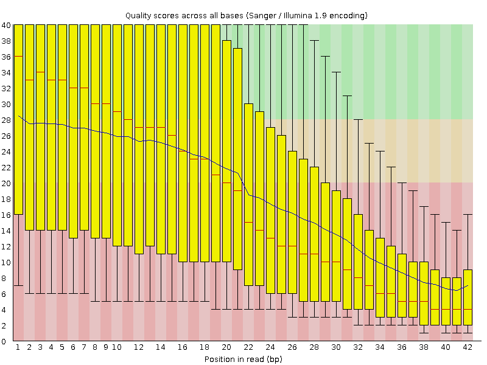

# **Para _E.coli_**

## Usando bwa para _indexar_ el genoma de _E.coli_

Se comienza por crear un entorno de trabajo con los archivos necesarios para la práctica

```bash
# Se crea un screen de la práctica para poder recurrir a los comandos en distintos momentos
screen -r -D Alignment

# Pasar archivos que se necesitan a carpeta de trabajo
cp -r /mnt/Timina/bioinfoII/data/alignment/ /mnt/Timina/bioinfoII/arodriguez/alignment

# Cargar módulos
module load bwa/0.7.15
module load fastqc/0.11.3
module load samtools/1.9

```
Para este alineamiento, los archivos `Escherichia_coli_K12_MG1655.fasta` y `SRX189773_FNR_ChIP.fastq` se refieren al genoma de referencia y a las lecturas del experimento, respectivamente.


## Usando bwa para _indexar_ el genoma de _E.coli_

Los índices permiten a las herramientas de alineación (STAR, BWA, minimap2) recuperar rápida y eficientemente la información de la secuencia de referencia, ahorrando tiempo y memoria.

```bash
bwa index -p E_index -a bwtsw Escherichia_coli_K12_MG1655.fastax
```

- `-p` indica el prefijo de los archivos generados
- `-a` elige alguno de los algoritmos de indexación de bwa (en este caso bwtsw).

## Alinea las lecturas de un experimento de FNR Chip-seq 

```bash
bwa aln E_index SRX189773_FNR_ChIP.fastq > Escherichia.sai
bwa samse E_index Escherichia.sai SRX189773_FNR_ChIP.fastq > Escherichia.sam
```

- `bwa aln` alinea el archivo de entrada de datos de secuencia con el genoma de referencia y produce un archivo `*.sai` de todos los posibles candidatos.
- `samse` genera los alineamientos en un archivo `.sam` dado un archivo `.sai` y el prefijo dado en `aln` (`E_index` en este caso). Se utiliza en lecturas *single-end*.

### Otras alternativas 

```bash
# Opcion 1
bwa aln E_index SRX189773_FNR_ChIP.fastq > Escherichia.bwa
bwa samse E_index Escherichia.bwa SRX189773_FNR_ChIP.fastq > Escherichia.sam

# Opcion 2
bwa mem E_index SRX189773_FNR_ChIP.fastq > Escherichia.sam
```

- `mem` se refiere al algoritmo mem, que es uno de los tres algoritmos proporcionados por BWA. Realiza la alineación local y produce alineaciones para diferentes partes de la secuencia de consulta.

## Análisis de calidad del alineamiento

```bash
# Opción 1
samtools view -H Escherichia.sam | less -S
# Opción 2
samtools stats Escherichia.sam | grep 'SN'
# Opción 3
samtools flagstat Escherichia.sam
```

1. raw total sequences --> Numero total de lecturas en el archivo. 
2. Sequences --> Reads totales
3. reads mapped --> Numero de lecturas mapeadas.
4. Reads unmapped --> Numero de lecturas no mapeadas
5. Reads MQ0 --> Lecturas con calidad de MQ0 (mapea en 10 o mas lugares)
6. Total lenght --> Numero de bases que no son secundarias (mapean en mas de un lugar) o suplementarias 
7. Bases mapped --> Numero de bases que pertenecen a las lecturas mapeadas.
8. Mismatches --> Mistmatches
9. Error rate --> Mismatches / Bases mapeadas (cigar)

- El numero total de lecturas es de: $3,603,544$, de las cuales $2,351,791$ (64.99%) lecturas mapean con el genoma de referencia.

- De las lecturas mapeadas, $85,370$ mapean en 10 lugares o mas, es decir, el $2.36905\%$.

- El ratio de error fue de $.00199$, esto indica que en $100,000$ secuencias, $199$ no mapearon.

- La calidad en promedio fue de $34.6$, es decir, el error de secuenciacion esta entre $0.1\%$ (Phred 30) y $0.01\%$ (Phred 40).

Dado que son datos de un experimento de ChiP-seq, se espera que el porcentaje de lecturas que mapean correctamente a la referencia sea bajo, de hehco, en este caso es de ~65%, lo cual se considera aceptable en este contexto. 

Considerando que los estadísticos mencionados anteriormente son aceptables, se puede concluir que el alineamiento es confiable.

# **Para _Mus musculus_**

## Control de calidad de las secuencias crudas (*raw sequences*)

__FastQC__, es una herramienta utilizada para proporcionar una visión general de las métricas básicas de control de calidad para los datos de secuenciación de próxima generación sin procesar. En este caso, los datos crudos de las lecturas se encuentran en el archivo `mus_musculus_CEBPA_liver_ERR005132.fastq.gz`

```bash
# Analisis fastqc
fastqc mus_musculus_CEBPA_liver_ERR005132.fastq.gz
# Obtener las imagenes a computadora local
rsync -rptuvl arodriguez@dna.lavis.unam.mx:\
/mnt/Timina/bioinfoII/arodriguez/alignment/Musmusculus/fastqc_analisys .
```
La longitud promedio de estas lecturas de de 42 bp, mientras que el porcentaje global de GC en todas las bases de todas las secuencias fue de 45%. 

Analizando la **calidad de secuencia por base**, se denota un severo problema, ya que ni siquiera la mitad de las seceuncias tiene una calidad decente (<30, Fig.1).  Por otro lado, parece ser que los **puntajes de calidad de cada carril** (*tile*) fueron constantemente aceptables (Fig.2), sin embargo se pueden observar diferentes zonas con colores un poco mas calidos al resto, lo que significa que se observarán sesgos en las secuencias obtenidas. De igual forma, los **puntajes de calidad por secuencia** arrojan resultados inquietantes, ya que se muchos se encuentran cercanos a 6 (un error cada 4 bp) y el promedio general por secuencia es de ~15 phred (Fig.3).

En conclusión, a pesar de que otros parametros no sean significativamente malos, se aconseja fuertemente no considerar ninguna conclusion obtenida en este informe como significativa.




## Index para el genoma de *Mus musculus*

Los archivos de *indexación* y el genoma de referencia se encuentran en el siguiente directorio del cluster:

```bash
/mnt/Archives/genome/mouse/mm10/UCSC/bwa-0.7.15-index/index
```

Donde `mm10.fa` se refiere al genoma de referencia (Genome Reference Consortium Mouse Build 38 (GCA_000001635.2)); mientras que `mm10.fa.amb`, `mm10.fa.ann`, `mm10.fa.bwt`, `mm10.fa.pac`, y `mm10.fa.sa` son los archivos del *index*.

## Alineacion del genoma de raton de un experimento ChiP-seq utilizando bwa

Antes de realizar el alineamiento, verificamos el tamaño de los archivos 

```bash
cd /mnt/Archives/genome/mouse/mm10/UCSC/bwa-0.7.15-index/index
ls -lh
```

Teniendo en cuenta el tamaño de los archivos tanto del genoma de referencia *Mus musculus* como de los datos de ChIP-seq de CEBPA, la memoria disponible para las sesiones de `qlogin` podría no ser suficiente, y probablemente haría que el proceso se suspendiera indefinidamente. Por lo tanto se generó un script sge llamado `MusculusAlignment.sge`, el cual contiene lo siguiente:

```bash
#!/bin/bash
#
# Use Current working directory
#$ -cwd
#
# Join stdout and stderr
#$ -j n
#
# Run job through bash shell
#$ -S /bin/bash
#
# You can edit the script since this line
#
# Your job name
#$ -N MusculusAlignment
#
# Send an email after the job has finished
#$ -m e
#$ -M axelrdz5205@gmail.com
#
#
# If modules are needed, source modules environment (Do not delete the next line):
. /etc/profile.d/modules.sh
#
# Add any modules you might require:
module load bwa/0.7.15
#
# Write your commands in the next line

# Generar alineamiento
# trabajando en /mnt/Timina/bioinfoII/arodriguez/alignment/Musmusculus/
bwa mem -M -t 8 /mnt/Archives/genome/mouse/mm10/UCSC/bwa-0.7.15-index/index/mm10.fa \ 
./mus_musculus_CEBPA_liver_ERR005132.fastq.gz > Mus_alg.sam

# -M deja la mejor (más larga) alineación para una lectura como alineación primaria 
#    y alineaciones adicionales para la lectura como secundaria
# -t indica el número de núcleos de procesador utilizados para hacer la alineación
```

## Analisis de calidad del alineamiento

```bash
# Opción 1
samtools view -H Mus_alg.sam | less -S
# Opción 2
samtools stats Mus_alg.sam | grep 'SN'
# Opción 3
samtools flagstat Mus_alg.sam
```

Primeramente, dado los datos arrojados podemos observar que seguramente existe un error de secuenciación ya que tenemos un promedio de calidad de 18.7%, además, una taza de error mayor a un 1% (2.094056e-02 por cada 1 000 bases mapeadas), de tal forma que la calidad de secuenciación es baja.

Ahora bien, las lecturas mapeadas fueron 6,530,881 y las no mapeadas cuentan con un número mayor, siendo este de 10, 640, 249. Finalmente, la calidad de mapeo fue de MQ = 0, lo cual una vez más nos hace pensar que hubo un error durante la secuenciación. 

# **Referencias** 

- BabrahamBioinf (Director). (2010, septiembre 22). *Using FastQC to check the quality of high throughput sequence*. [https://www.youtube.com/watch?v=bz93ReOv87Y](https://www.youtube.com/watch?v=bz93ReOv87Y)
- *Bwa Aln And Samse Options*. (s/f). Recuperado el 28 de febrero de 2023, de [https://www.biostars.org/p/59572/](https://www.biostars.org/p/59572/)
- *Bwa.1*. (s/f). Recuperado el 28 de febrero de 2023, de [https://bio-bwa.sourceforge.net/bwa.shtml](https://bio-bwa.sourceforge.net/bwa.shtml)
- *FastQC Tutorial & FAQ*. (s/f). Recuperado el 28 de febrero de 2023, de [https://rtsf.natsci.msu.edu/genomics/tech-notes/fastqc-tutorial-and-faq/](https://rtsf.natsci.msu.edu/genomics/tech-notes/fastqc-tutorial-and-faq/)
- *HCC-DOCS*. (s/f). Recuperado el 28 de febrero de 2023, de [https://hcc.unl.edu/docs/applications/app_specific/bioinformatics_tools/alignment_tools/bwa/running_bwa_commands/](https://hcc.unl.edu/docs/applications/app_specific/bioinformatics_tools/alignment_tools/bwa/running_bwa_commands/)
- *Index of /projects/fastqc/Help/3 Analysis Modules*. (s/f). Analysis Modules. Recuperado el 28 de febrero de 2023, de [https://www.bioinformatics.babraham.ac.uk/projects/fastqc/Help/3%20Analysis%20Modules/](https://www.bioinformatics.babraham.ac.uk/projects/fastqc/Help/3%20Analysis%20Modules/)
- *Practical 2: Short Read Alignment*. (s/f-a). Recuperado el 28 de febrero de 2023, de [https://bioinformatics-core-shared-training.github.io/cruk-summer-school-2018/Introduction/SS_DB/Materials/Practicals/Practical2_alignment_SS.html#short-read-alignment-and-quality-control](https://bioinformatics-core-shared-training.github.io/cruk-summer-school-2018/Introduction/SS_DB/Materials/Practicals/Practical2_alignment_SS.html#short-read-alignment-and-quality-control)
- *Practical 2: Short Read Alignment*. (s/f-b). Recuperado el 28 de febrero de 2023, de [https://bioinformatics-core-shared-training.github.io/cruk-summer-school-2019/Introduction/SS_DB/Materials/Practicals/Practical2_alignment_JK.html#reference-genome-index](https://bioinformatics-core-shared-training.github.io/cruk-summer-school-2019/Introduction/SS_DB/Materials/Practicals/Practical2_alignment_JK.html#reference-genome-index)
- Skidmore, Z. (2d. C., abril 1). *Indexing*. Griffith Lab. [http://www.pmbio.org//module-02-inputs/0002/04/01/Indexing/](http://www.pmbio.org//module-02-inputs/0002/04/01/Indexing/)
- *What is the purpose of indexing a genome*. (s/f). Recuperado el 28 de febrero de 2023, de [https://www.biostars.org/p/212594/](https://www.biostars.org/p/212594/)
