# Utiliza IGV para vizualizar datos de  *Plasmodium chabaudi* (*P. chabaudi*)

```bash

# Ubicacion de archivos
cd /mnt/Timina/bioinfoII/data/IGV/

# Pasar archivos a computadora local para utilizarlos en IGV
# -r Recursivo
# -p Establecer permisos igual que en origen
# -t Transfiere los tiempos del archivo al destino
# -u Si un archivo es mas nuevo en la fuente que en el destino, salta la instalacion del archivo nuevo al destino
# -v Muestra el progreso del proceso
# -l Si encuentra enlaces simbolicos (symlinks) son recreados en el destino
rsync -rptuvl arodriguez@dna.lavis.unam.mx:/mnt/Timina/bioinfoII/data/IGV/PccAS_v3_genome.fa .
rsync -rptuvl arodriguez@dna.lavis.unam.mx:/mnt/Timina/bioinfoII/data/IGV/PccAS_v3_genome.fa.fai .
rsync -rptuvl arodriguez@dna.lavis.unam.mx:/mnt/Timina/bioinfoII/data/IGV/PccAS_v3.gff3 .

```

- El archivo `PccAS_v3_genome.fa` es el archivo con el genoma de referencia de *P. chabaudi*.

- El archivo `PccAS_v3.gff3` contiene las anotaciones del genoma. Contiene las regiones que son intrones y exones.

## Carga el genoma de referencia desde un archivo (nota que ha sido _indexado_ )

Para cargar el genoma de referencia en IGV se va a `Genomes -> Load Genome from File…"`. Se selecciona "`PccAS_v3_genome.fa`” y se da clic en “`open`".

## Carga las anotaciones del genoma

Para cargar el archivo de anotacion, se da click en `"File -> Load from File…"` y se selecciona "`PccAS_v3.gff3`” para despues dar click en “`Open`”.

### ¿Que describe el formato del archivo de anotaciones?

No sólo se requiere ver dónde han mapeado las lecturas, sino a qué genes han mapeado. Para ello, se tiene el archivo de anotación en **formato GFF3** (`PccAS_v3.gff3`), el cual contiene una lista de características, coordenadas y orientaciones correspondientes al genoma de referencia.

### ¿Que esta mostrando el _browser_?

Una vez cargado el archivo, se despliega una nueva pista llamada "**PccAS_v3. gff3**". La pista se muestra como un gráfico de densidad. 

### ¿Qué pasa si te acercas o te alejas?

Se puede hacer **zoom** para ver los genes individuales, incluyendo intrones y exones. Si se hace ***zoom out*** las ubicaciones de los genes se superponen mostrando la abundancia relativa de genes en todo el genoma. la flecha nos indica la direccion en la que el gen se transcribe.

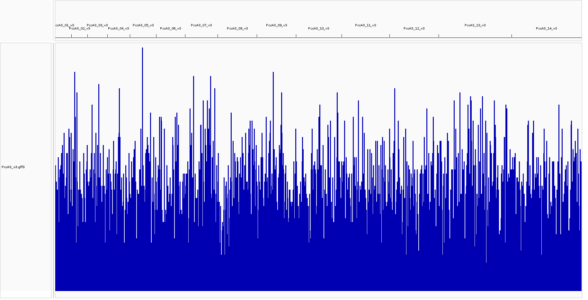


---------------------------------------------------------------------------------------------------
## Coverage Track

- El 'coverage track' muestra la cobertura de las lecturas en cada locus con una grafica gris. Si un nucleotido difiere de la referencia en mas del 20% (por default), IGV lo colorea de acuerdo a la proporcion del nucleotido.

- Podemos ver la cobertura en un determinado locus haciendo zoom y haciendo click derecho a la grafica.

- Podemos aumentar la cobertura con otro archivo en extension 'TDF'.

## Splice junction track
- Las uniones en la hebra + son de color rojo y sobre la linea que se muestra, mientras que las uniones de la hebra - son de color azul y estan por debajo de la linea.

-Haciendo click derecho sobre la union podemos observar la informacion de cobertura.

## Alligment track

- Las inserciones son indicadas con morado. 

- Las deleciones son indicadas con un -.

# Cómo exportar figuras?
Haciendo click derecho y seleccionando la opicon hasta abajo "save PNG image"...

En la pista de anotación, los genes se presentan como cajas azules y líneas. Estas cajas representan exones, mientras que las líneas representan regiones intrónicas. Las flechas indican la dirección (o cadena) de la transcripción para cada uno de los genes. Ahora que tenemos nuestro genoma y sus características anotadas, sólo necesitamos las alineaciones de lectura para nuestras cinco muestras.

------------------------------------------------------------------------------------------------

# Utiliza IGV para cargar un archivo de alineamiento para un experimento de RNA-seq (MT1 y MT2)


## ¿Están los datos en el formato correcto?

No, los archivos a disposicion se encuentran en formato `fastq`.

## ¿Qué tipo de datos se necesitan?

Es necesaria el alineamiento de las lecturas, del cual el resultado es un archivo `.bam`, que es el formato requerido.

## ¿Por qué hay dos archivos por muestra?

Porque las lecturas crudas vienen de una secuenciacion **********paired-end**********. 

## Alineamiento de lecturas

Se trata de datos de RNA-seq así que necesitamos alineadores especiales para tener en cuenta las isoformas.

Usaremos **[HISAT2](http://daehwankimlab.github.io/hisat2/manual/)** para mapear las lecturas de RNA-Seq de nuestras muestras al genoma de referencia. HISAT2 es un programa de alineación rápido y sensible para el mapeo de lecturas de secuenciación de próxima generación (tanto de DNA como de RNA) a una población de genomas humanos (así como a un solo genoma de referencia).

## Indexación del genoma

```bash

# Cargar los modulos necesarios
module load  hisat2/2.0.0-beta

# Copiar archivos necesarios a carpeta de trabajo 
cd /mnt/Timina/bioinfoII/data/IGV/
cp -r ./ ../../arodriguez/GenBrowser/

# Indexar el genoma
hisat2-build PccAS_v3_genome.fa PccAS_v3_hisat2.idx
```

- `hisat2-build` construye un índice HISAT2 a partir del archivo de genoma de referencia (`PccAS_v3_genome.fa`) y el prefijo que tendra el conjunto de archivos de salida generados por el mismo (`PccAS_v3_hisat2.idx`):

```bash
PccAS_v3_hisat2.idx.1.ht2
PccAS_v3_hisat2.idx.2.ht2
PccAS_v3_hisat2.idx.3.ht2
PccAS_v3_hisat2.idx.4.ht2
PccAS_v3_hisat2.idx.5.ht2
PccAS_v3_hisat2.idx.6.ht2
PccAS_v3_hisat2.idx.7.ht2
PccAS_v3_hisat2.idx.8.ht2
```

<div class="alert alert-block alert-info">
**Nota**: estos ficheros juntos constituyen el índice. Son todo lo que se necesita para alinear las lecturas a esa referencia..
</div>

-------------------------------------------------------------------------------------------------------------------------

# PARTE 2

## Generar alineamiento con MT1
```bash
# Generar alineamiento
hisat2 --max-intronlen 10000 -x PccAS_v3_hisat2.idx -1 MT1_1.fastq -2 MT1_2.fastq -S MT1.sam

# Convertir SAM-->BAM

# Se cargan los modulos 
module load samtools/1.9

# Se convierte SAM a BAM
samtools view -bS MT1.sam > MT1.bam

# Ordenar el archivo 
samtools sort MT1.bam -o MT1_sorted.bam

#Indezar el archivo
samtools index MT1_sorted.bam
```

## Generar alineamiento con MT2
```bash
# Generar alineamiento
hisat2 --max-intronlen 10000 -x PccAS_v3_hisat2.idx -1 MT2_1.fastq -2 MT2_2.fastq -S MT2.sam

# Convertir SAM-->BAM

# Se cargan los modulos 
module load samtools/1.9

# Se convierte SAM a BAM
samtools view -bS MT2.sam > MT2.bam

# Ordenar el archivo 
samtools sort MT2.bam -o MT2_sorted.bam

#Indezar el archivo
samtools index MT2_sorted.bam
```

- HISAT2 utiliza una alineación basada en gráficos. El resultado de este paso será un archivo SAM/BAM para cada conjunto de datos (MT1 y MT2).

- `–max-intronlen 10000` indica que la **longitud máxima de intrón** admitida será 10000.

- `-x` indica el prefijo que elegimos para nuestros **ficheros de índice** con `hisat2-build` (`PccAS_v3_hisat2. idx`)

- `-1` y `-2` para referirse a los ficheros de lectura izquierdo y derecho para la muestra `MT1_1. fastq` y `MT1_2. fastq` respectivamente.

- `-S` indica el nombre del archivo al que se requiere escribir la alineación de salida (`MT1. sam` y `MT2.sam`) ya que, por defecto, hisat2 imprimirá los resultados en la terminal (stdout).

## De BAM a SAM

Para hacer algo significativo con los datos de alineación de los alineadores (que producen salida SAM basada en texto), primero necesitamos convertir el SAM a su contraparte binaria, el formato **BAM**. El formato binario es mucho más fácil para los programas de computadora trabajar con él, ademas de que ocupa menos espacio de memoria. Sin embargo, en consecuencia, es muy difícil para los seres humanos leer.

Para convertir SAM a BAM, utilizamos el comando `samtools view`. Debemos especificar que nuestra entrada está en formato SAM (por defecto se espera BAM) usando la opción `-S`. También debemos decir que queremos que la salida sea BAM (por defecto produce BAM) con la opción `-b`. Samtools sigue la convención UNIX de enviar su salida a UNIX STDOUT, por lo que necesitamos usar un operador de redirección (“`>`”) para crear un archivo BAM a partir de la salida.


# Visualizar en IGV
```bash
# Obtener archivos a computadora local.
# Trabajando en /home/axel/Documents/ENES/4toSem/Bioinfo/T03

# Descargar alineamientos
rsync -rptuvl arodriguez@dna.lavis.unam.mx:/mnt/Timina/bioinfoII/arodriguez/GenBrowser/Pchabaudi/MT1_sorted.bam .
rsync -rptuvl arodriguez@dna.lavis.unam.mx:/mnt/Timina/bioinfoII/arodriguez/GenBrowser/Pchabaudi/MT2_sorted.bam .

# Descargar sus index
rsync -rptuvl arodriguez@dna.lavis.unam.mx:/mnt/Timina/bioinfoII/arodriguez/GenBrowser/Pchabaudi/MT1_sorted.bam.bai .
rsync -rptuvl arodriguez@dna.lavis.unam.mx:/mnt/Timina/bioinfoII/arodriguez/GenBrowser/Pchabaudi/MT2_sorted.bam.bai .

# Obtener archivos a computadora local.
rsync -rptuvl mrivera@dna.lavis.unam.mx:/mnt/Timina/bioinfoII/mrivera/Pchabaudi/MT1_sorted.bam .
rsync -rptuvl mrivera@dna.lavis.unam.mx:/mnt/Timina/bioinfoII/mrivera/Pchabaudi/MT2_sorted.bam .
rsync -rptuvl mrivera@dna.lavis.unam.mx:/mnt/Timina/bioinfoII/mrivera/Pchabaudi/MT1_sorted.bam.bai .
rsync -rptuvl mrivera@dna.lavis.unam.mx:/mnt/Timina/bioinfoII/mrivera/Pchabaudi/MT2_sorted.bam.bai .
```

## Por que ordenar el archivo BAM?

Cuando se alinean las lecturas con HISAT2, las alineaciones se produjeron en el mismo orden que las secuencias de nuestros archivos FASTQ. Para indexar el archivo BAM necesitamos que las alineaciones se ordenen por sus respectivas posiciones en el genoma de referencia. Podemos hacer esto usando `samtools sort`, que ordenará las alineaciones por sus coordenadas para cada cromosoma.

## Por que generar el index del archivo BAM?

Generar un index para el archivo BAM hace que buscar las alineaciones sea mucho más eficiente. Permite que programas como IGV obtengan rápidamente las alineaciones que se superponen a las regiones genómicas que están viendo. Podemos hacer esto con `samtools index`, que generará un archivo index con la extensión `.bai`.


## Cargar y visualizar el genoma en IGV
```bash
# Obtener archivos a computadora local.
# Trabajando en /home/axel/Documents/ENES/4toSem/Bioinfo/T03

# Descargar alineamientos
rsync -rptuvl arodriguez@dna.lavis.unam.mx:/mnt/Timina/bioinfoII/arodriguez/GenBrowser/Pchabaudi/MT1_sorted.bam .
rsync -rptuvl arodriguez@dna.lavis.unam.mx:/mnt/Timina/bioinfoII/arodriguez/GenBrowser/Pchabaudi/MT2_sorted.bam .

# Descargar sus index
rsync -rptuvl arodriguez@dna.lavis.unam.mx:/mnt/Timina/bioinfoII/arodriguez/GenBrowser/Pchabaudi/MT1_sorted.bam.bai .
rsync -rptuvl arodriguez@dna.lavis.unam.mx:/mnt/Timina/bioinfoII/arodriguez/GenBrowser/Pchabaudi/MT2_sorted.bam.bai .
```

Una vez cargados los archivos `MT1_sorted.bam`, `MT2_sorted.bam`, `MT1_sorted.bam.bai` y `MT2_sorted.bam.bai` en una carpeta local, en IGV se selecciona `File->Load from Filee`, se seleccionan los archivos bam ordenados (`MT1_sorted.bam` y `MT2_sorted.bam`) y se da click en `Open`. Es importante mencionar que los archivos BAM y sus correspondientes ficheros índice deben estar en el mismo directorio para que IGV los cargue correctamente. 

## ¿Qué ves, explora el genoma?

Esto cargará dos nuevas pistas llamadas "**MT1_sorted. bam**" y “**MT2_sorted. bam**” que contienen las alineaciones de lecturas (*read alignments*) para la muestra MT1 y MT2, respectivamente. 

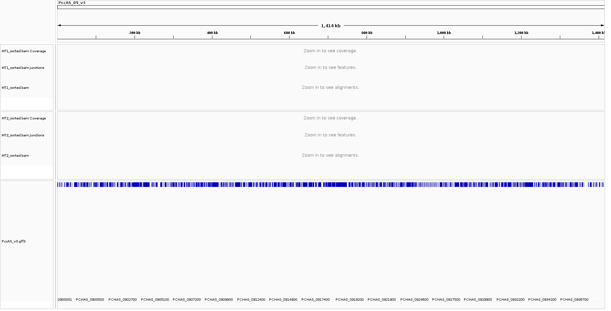

Podemos cambiar la forma en que visualizamos nuestros datos modificando las opciones de visualización. Por defecto, IGV mostrará las lecturas individualmente para que estén dispuestas de forma compacta. Si se desplaza sobre una lectura en la vista predeterminada, sólo obtendrá los detalles de esa lectura. Sin embargo, si cambiamos nuestra vista para que las lecturas se visualicen como pares, los pares leídos se unirán por línea y cuando nos desplacemos sobre cualquiera de las lecturas, obtendremos información sobre las dos lecturas de ese par.

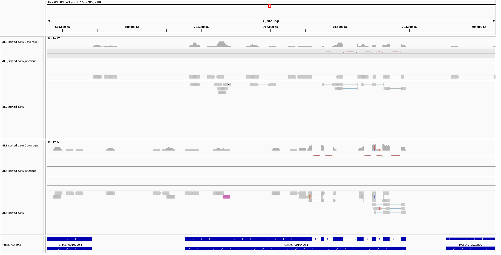

Dado que tenemos datos de secuencias de ARN, lo que estamos viendo son regiones de ADN que se están expresando en la célula.

## Visualiza el loci: PCHAS_0505200

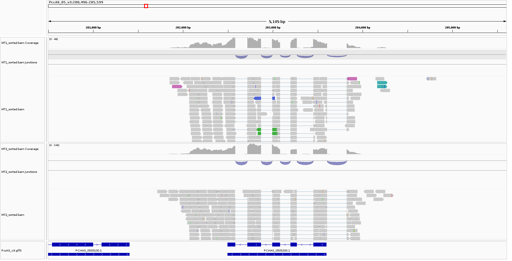

### Qué es lo que ves?

**Interpreting Color by Insert Size** **Interpretacion del color por el tamaño del _insert_**

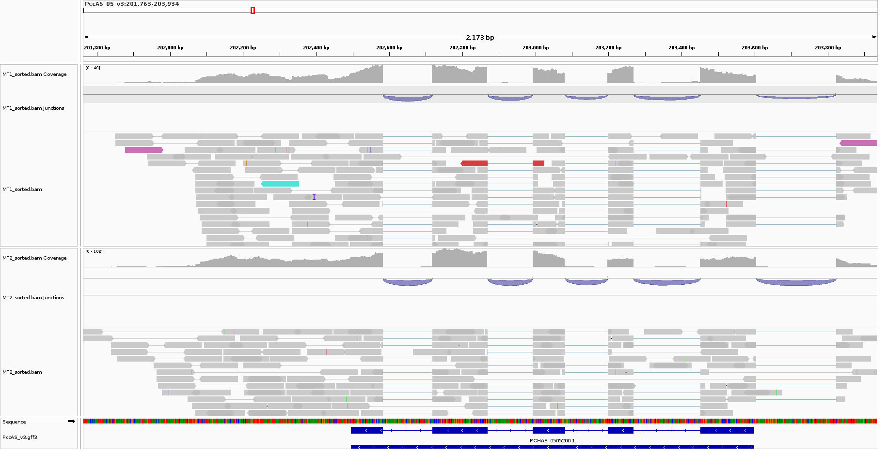

IGV utiliza codificación de color para marcar tamaños de inserción anómalos. Se llega a observar lecturas de color rojo opaco, rosado y verde menta, los cuales nos indican lecturas *paired-end* que estan codificadas por el cromosoma en donde sus pares pueden ser encontrados. 

**Interpretacion de color por la orientacion de los pares**

Al seleccionar `Color alignments>by pair orientation`, se pueden marcar orientaciones de pares anómalas en IGV. 

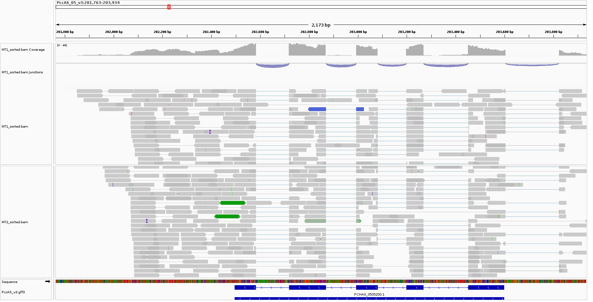
Se denota lecturas en color verde, lo cual puede indicar una duplicacion o translocacion con respecto a la referencia. El color azul en las lecturas indica alguna inversion.

## Vizualizar loci: PCHAS_1409500


### Qué es lo que ves?

**Interpreting Color by Pair Orientation** **Interpretacion de color por tamaño del _insert_**

Se detectaron arreglos inter-chromosomales

**Interpretando el color por la orientacion de los pares**

Se observaron los mismos colores que indican una posible inversion.

## Puedes exportar la figura?

Si, dando click en `File->Save PNG image`.

# Visualizacion los datos del ratón que alineaste en ejercicios anteriores.

En un archivo `.sge` llamado `MusculusSorted.sge`. Se utilizo este archivo para generar el alineamiento

```bash
#!/bin/bash
#
# Use Current working directory
#$ -cwd
#
# Join stdout and stderr
#$ -j n
#
# Run job through bash shell
#$ -S /bin/bash
#
# You can edit the script since this line
#
# Your job name
#$ -N MusculusAlignment
#
# Send an email after the job has finished
#$ -m e
#$ -M axelrdz5205@gmail.com
#
#
# If modules are needed, source modules environment (Do not delete the next line):
. /etc/profile.d/modules.sh
#
# Add any modules you might require:
module load samtools/1.9
#
# Write your commands in the next line

# # trabajando en /mnt/Timina/bioinfoII/arodriguez/GenBrowser/MusMusculus
# Convertir archivo SAM a BAM
samtools view -bS /mnt/Timina/bioinfoII/arodriguez/alignment/Musmusculus/Mus_alg.sam > Mus_alg.bam
# Ordenar (sort) el BAM
samtools sort ./Mus_alg.bam -o Mus_alg_sorted.bam
# Generar index del archivo BAM
samtools index ./Mus_alg_sorted.bam
```

Se descargaron los archivos
```bash
# Genoma de referencia
cd /mnt/Archives/genome/mouse/mm10/UCSC/bwa-0.7.15-index/index/mm10.fa

# Genoma a alinear
cd /mnt/Timina/bioinfoII/data/alignment/mus_musculus_CEBPA_liver_ERR005132.fastq.gz

# Ubicacion de aineamiento
cd /mnt/Timina/bioinfoII/mrivera/MusMusculus/Mus_alg_sorted.bam

# Descargar alineamiento 
rsync -rptuvl mrivera@dna.lavis.unam.mx:/mnt/Timina/bioinfoII/mrivera/MusMusculus/Mus_alg_sorted.bam .

# Descargar index
rsync -rptuvl mrivera@dna.lavis.unam.mx:/mnt/Timina/bioinfoII/mrivera/MusMusculus/Mus_alg_sorted.bam.bai .

```
## Es un conjunto de datos hepáticos, ¿puedes apuntar a un loci interesante?

1. Gabrb1

Permite la actividad de unión del receptor GABA, la actividad del canal iónico de cloruro activado por GABA y la actividad del canal iónico activado por transmisor implicado en la regulación del potencial de membrana postsináptico

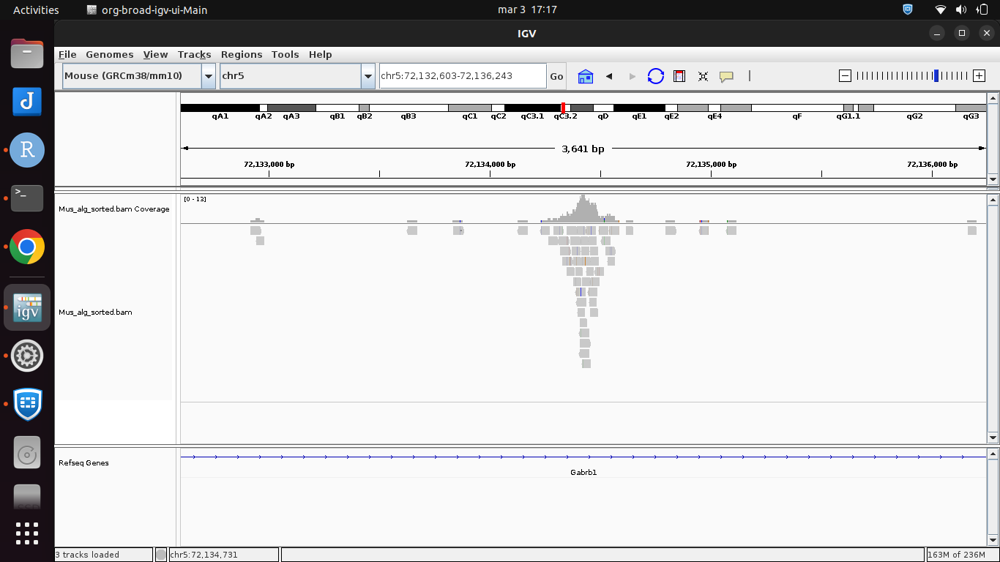

2. Tmem33

Interviene en la organización de la red tubular del retículo endoplásmico, la regulación positiva de la respuesta a proteínas no plegadas del retículo endoplásmico y la regulación de la organización de la red tubular del retículo endoplásmico

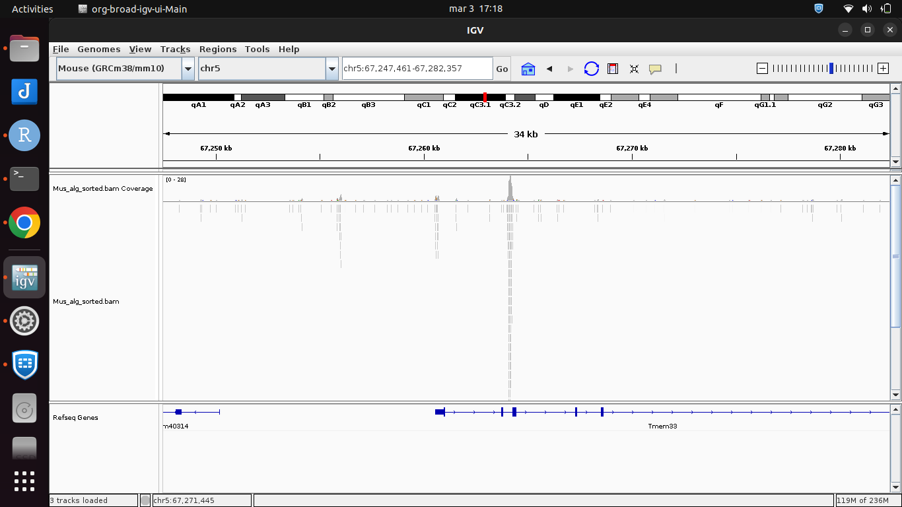

3. Limch1

Permite la actividad de unión de la cabeza/cuello de la miosina II. Está implicada en la contracción citoplasmática de actina implicada en la motilidad celular, en la regulación positiva del ensamblaje de las fibras de estrés y en la regulación del ensamblaje de la adhesión focal.

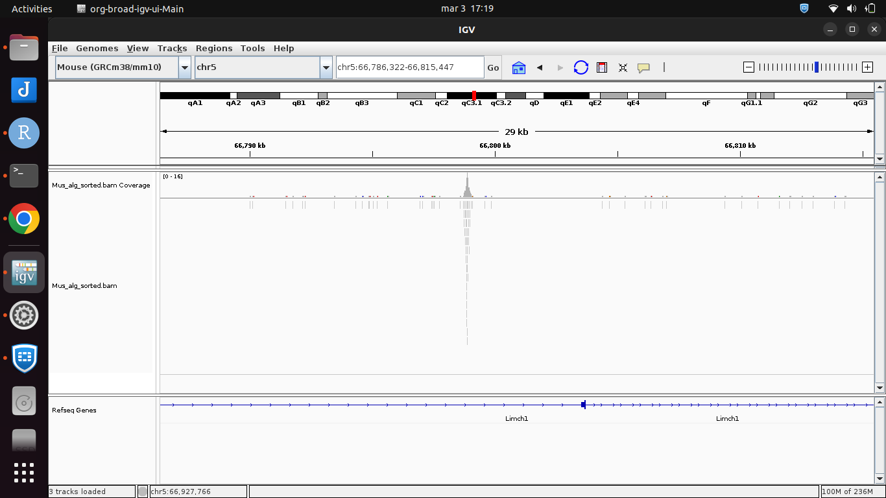

4. Rbm47

Permite la actividad de unión al ARN. Actúa antes o durante la edición de citidina a uridina y la diferenciación de células  hematopoyéticas. Se localiza en el núcleo.

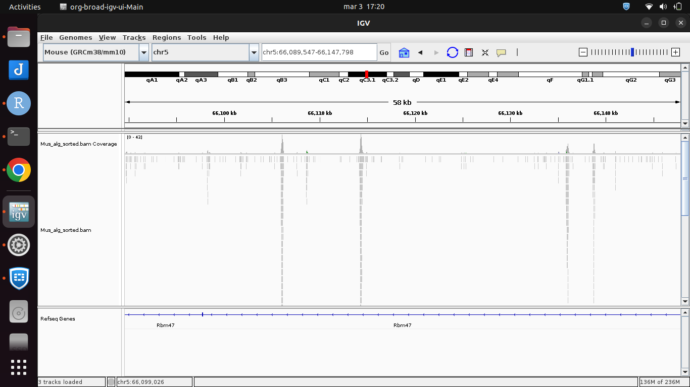

--------------------------------------------------------------------------------

# Visualizacion con  _USCS Genome Browser_

ChiP-seq data displays the genomic locations of transcription factor binding or histone modifications.

## **¿Cómo puedes subir los datos?**

Primero, subimos los archivos 

```bash
#Obtener archivos a computadora local
rsync -rptuvl arodriguez@dna.lavis.unam.mx:/mnt/Timina/bioinfoII/arodriguez/GenBrowser/MusMusculus/Mus_alg_sorted.bw .
```

Despues, dentro del navegador del genoma de USCS, dando click en `add custom tracks->Track hubs->My hubs <pegar URL>`

## **¿Que es BigWig?** 

Los ficheros BigWig son un formato binario comprimido, indexado para datos de señales de todo el genoma para cálculos (por ejemplo, porcentaje de GC) o experimentos (por ejemplo, ChIP-seq/RNA-seq *read depth*). Una de las ventajas que brinda este formato es que sólo los datos de la región relevante se cargan en el navegador del genoma, lo que hace que la visualización de los datos sea significativamente más rápida.

## Crea un archivo BigWig utilizando deepTools

```bash
# Cargar modulos necesarios
module load deeptools/2.5.3
# Crear archivo BigWIg de lecturas de experimento ChiP-seq de raton
bamCoverage -b Mus_alg_sorted.bam -o Mus_alg_sorted.bw
```

- `-b` es para especificar el archivo BAM a procesar
- `-o` se usa para especificar el nombre y el formato del archivo de salida

## **¿Puede contextualizar sus resultados a otros conjuntos de datos disponibles?**

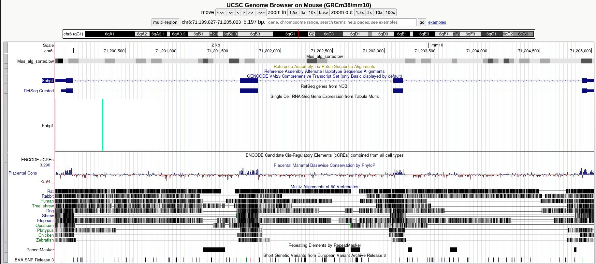

Sí, podemos usar las anotaciones y las opciones de múltiples pistas para cargar otros conjuntos de datos para comparar con nuestros resultados. En este ejemplo, las primeras pistas adicionales son los genomas de referencia GenCode y NCBI. En este caso, también cargamos cCREs ENCODE para comparar con nuestros resultados.

Aquí visualizamos la vista del navegador UCSC de los datos del experimento de ChiP-seq al factor de transcripcion de higado de raton Cebpa (CCAAT/enhancer-binding protein alfa) alineados con el genoma de referencia mm10, mostrando las regiones del genoma unidas por este factor de transcripcion.

Específicamente en esta foto mostramos el gen Fabp1 (proteína fijadora de ácidos grasos 1), una enzima producida por hepatocitos que participa en la absorción de colesterol mediada por lipoproteínas. Aquí podemos ver múltiples regiones donde Cebpa está unido al gen Fabp1.

------------------------------------------------------------------------------------

# Referencias 

- Gabrb1 gamma-aminobutyric acid (GABA) A receptor, subunit beta 1 [Mus musculus (house mouse)] - Gene - NCBI. (n.d.). Nih.gov. Retrieved March 3, 2023, from https://www.ncbi.nlm.nih.gov/gene/14400

- Limch1 LIM and calponin homology domains 1 [Mus musculus (house mouse)] - Gene - NCBI. (n.d.). Nih.gov. Retrieved March 3, 2023, from https://www.ncbi.nlm.nih.gov/gene/77569

- Rbm47 RNA binding motif protein 47 [Mus musculus (house mouse)] - Gene - NCBI. (n.d.). Nih.gov. Retrieved March 3, 2023, from https://www.ncbi.nlm.nih.gov/gene/245945

- Tmem33 transmembrane protein 33 [Mus musculus (house mouse)] - Gene - NCBI. (n.d.). Nih.gov. Retrieved March 3, 2023, from https://www.ncbi.nlm.nih.gov/gene/67878


