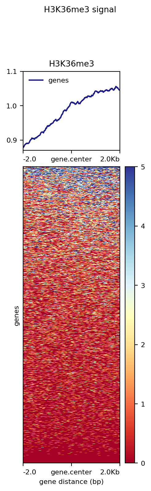
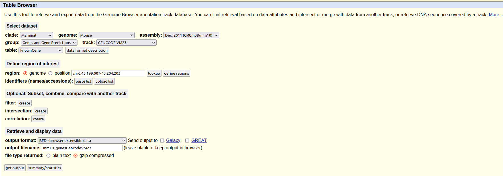
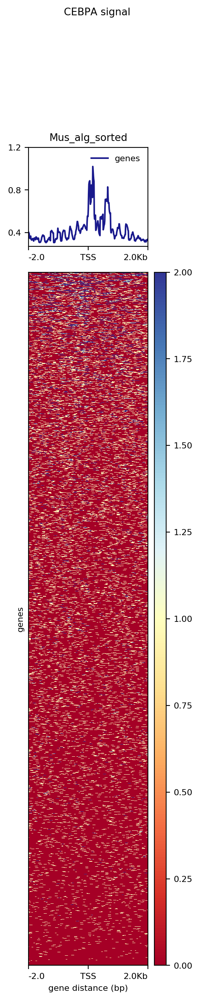
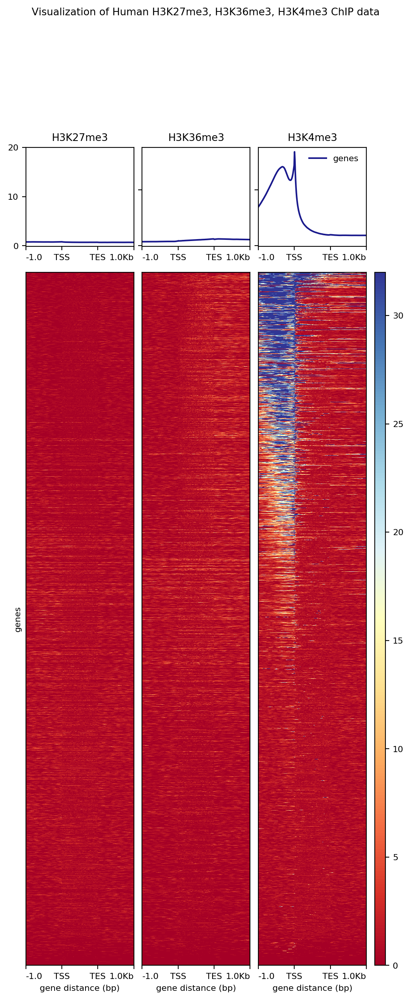

# Crear plot de H3K36me3 (*visualization of Human H3K36me3 ChIP data*)

```bash

# Copiar los archivos necesarios a una carpeta de trabajo propia asignada para esta tarea

cd /mnt/Timina/bioinfoII/data/deepTools
cp H3K36me3.bw /mnt/Timina/bioinfoII/jgarcia/Tarea03
cp Human38_genesGencodev39.bed /mnt/Timina/bioinfoII/jgarcia/Tarea03 

# Cargar módulos
module load deeptools/2.4.1

#Generar una matriz de 2000 x 2000 que contenga las puntuaciones por regiones del genoma y preparar un archivo intermedio para usarse con el comando plotHeatmap.
computeMatrix reference-point -S H3K36me3.bw -R Human38_genesGencodev39.bed --referencePoint center -a 2000 -b 2000 -out matrix_H3K36me3_matrix.tab.gz

#Generar un mapa de calor para las puntuaciones asociadas a regiones genómicas
plotHeatmap -m matrix_H3K36me3_matrix.tab.gz -out H3K36me3_genes.png --heatmapHeight 15 --refPointLabel gene.center --regionsLabel genes --plotTitle ' H3K36me3 signal'

```



En esta imagen podemos observar en una región del centro de los genes a -2.0 kb hasta 2.0 Kb que las señales de la histona H3K36me3 en los genes humanos Gencodev39 no son lo suficientemente significativas como para llegar a una conclusión rotunda, sin embargo, podemos observar que hay una ligera señal aumentada en el sitio terminal de transcripción, al igual que en el sitio de inicio de la transcripción, pero en menor medida.

# Heatmap de ratón (*visualization of M. musculus Cebpa ChIP data*)

Para este ejemplo, vamos a crear un mapa de calor a partir de los datos ChIP-seq de la tarea anterior. Es necesario un fichero bigWig (`Mus_alg_sorted.bw`) que contenga los datos de cobertura del experimento y un fichero `.bed` que contenga las regiones de interés. En este caso, no tenemos un fichero `.bed` de referencia para ratón, pero es posible obtener uno entrando en el *[Table Browser](https://genome.ucsc.edu/cgi-bin/hgTables)* del *UCSC Genome Browser* y rellenando un formulario de la siguiente forma:




Finalmente podemos elegir la opción de `Create one BED record per: Whole Gene` y seguir la descarga del archivo bed.

Posteriormente, para poder utilizar el archivo generado (`mm10_genesGencodeVM23.gz`) dentro del cluster, se subió a Cyverse, generando un link de donde se puede descargar. Para obtener el archivo se utilizó el siguiente comando:

```bash
# Trabajando en /mnt/Timina/bioinfoII/arodriguez/Visualization
wget https://data.cyverse.org/dav-anon/iplant/home/axelrdz/Visualization/mm10_genesGencodeVM23.gz
```

Finalmente, se utilizó el archivo `HeatMapCEBPA.sge` para generar el mapa de calor que muestra la cobertura global del factor transcripcional de Cebpa en el genoma de ratones para los datos de visualización generados en la tarea anterior. El archivo contenia lo siquiente:

```bash
#!/bin/bash
#
# Use Current working directory
#$ -cwd
#
# Join stdout and stderr
#$ -j n
#
# Run job through bash shell
#$ -S /bin/bash
#
# You can edit the script since this line
#
# Your job name
#$ -N HeatMapMusculusCenter
#
# Send an email after the job has finished
#$ -m e
#$ -M axelrdz5205@gmail.com
#
#
# If modules are needed, source modules environment (Do not delete the next line):
. /etc/profile.d/modules.sh
#
# Add any modules you might require:
module load deeptools/2.4.1
#
# Write your commands in the next line

# Trabajando en /mnt/Timina/bioinfoII/arodriguez/Visualization
# Computar la matriz
computeMatrix reference-point -S ./Mus_alg_sorted.bw -R ./mm10_genesGencodeVM23.bed -p max/2 --referencePoint TSS -a 2000 -b 2000 -out matrix_M_CEBPA_ChIP.tab.gz
```

- `computeMatrix` calcula puntuaciones por regiones genómicas y prepara un archivo intermedio que puede utilizarse con `plotHeatmap` y `plotProfiles`.
- `reference-point` se refiere a una posición dentro de una región BED (por ejemplo, el punto de partida). En este modo, sólo se trazarán las posiciones genómicas antes (`upstream`) y/o después (`downstream`) del punto de referencia.
- `-S` (`--scoreFileName`) es el archivo(s) bigWig que contiene los puntajes que se van a *plotear*.
- `-R` (`--regionsFileName`) es el nombre o nombres de archivos, en formato BED o GTF, que contienen las regiones a *plotear*. Si se dan varios archivos BED, cada uno se considera un grupo que se puede trazar por separado.
- `-b` (`--beforeRegionStartLength`, `--upstream`) es la distancia *upstream* del punto de partida de las regiones definidas en el archivo de región (`mm10_genesGencodeVM23.bed`). Si las regiones son genes, esta sería la distancia *upstream* del sitio de inicio de la transcripción. (Por defecto: 0).
- `-a` (`--afterRegionStartLength`, `--downstream`) es la distancia *downstream* del punto final de las regiones dadas. Si las regiones son genes, esta sería la distancia aguas abajo del sitio final de la transcripción. (Por defecto: 0)
- `-out` (`--outFileName`, `-o`) es el nombre del archivo para guardar el fichero de la matriz computada.
- `-p max/2` s para indicar que use la mitad del numero maximo de procesadores para acelerar el proceso

En un job aparte, se creo el archivo `CEBPA_image.sge`, que contena lo siguiente:

```bash
#!/bin/bash
#
# Use Current working directory
#$ -cwd
#
# Join stdout and stderr
#$ -j n
#
# Run job through bash shell
#$ -S /bin/bash
#
# You can edit the script since this line
#
# Your job name
#$ -N CBPA_image
#
# Send an email after the job has finished
#$ -m e
#$ -M axelrdz5205@gmail.com
#
#
# If modules are needed, source modules environment (Do not delete the next line):
. /etc/profile.d/modules.sh
#
# Add any modules you might require:
module load deeptools/2.4.1
#
# Write your commands in the next line

# Trabajando en /mnt/Timina/bioinfoII/arodriguez/Visualization
# Crear Heatmap
plotHeatmap -m ./matrix_M_CEBPA_ChIP.tab.gz -out CEBPA_genes2.png --refPointLabel TSS --regionsLabel genes --plotTitle 'CEBPA signal'
```

- `plotHeatmap` crea un mapa de calor para las puntuaciones asociadas con regiones genómicas.
- `-m` indica el archivo de matriz generado por la herramienta `computeMatrix` (`matrix_M_CEBPA_ChIP.tab.gz`).
- `-out` indica el nombre del archivo en el que guardar la imagen. La terminación del archivo se utilizará para determinar el formato de la imagen. Las opciones disponibles son: “png”, “eps”, “pdf” y “svg”.
- `--refPointLabel` es una etiqueta mostrada en el *plot* para el punto de referencia. El valor predeterminado es el mismo que el punto de referencia seleccionado (p. ej. TSS), pero podría ser cualquier cosa, p. ej. “peak start”.
- `--plotTitle` es el título de la *plot*.

```bash
#Exportar a computadora local
rsync -rptuvl arodriguez@dna.lavis.unam.mx:/mnt/Timina/bioinfoII/arodriguez/Visualization/CEBPA_genes2.png .
```

```{r, echo = FALSE, fig.align='center', out.width=300}

```


Los datos se trazaron utilizando una matriz basada en puntos de referencia centrada con una ventana de ± 2 kbp. Como se muestra en la imagen, observamos un fuerte pico que marca el enriquecimiento de los eventos de unión de Cebpa a la izquierda del centro del gen, hacia los genes del inicio de la transcripcion, lo que estaría de acuerdo con su naturaleza como factor de transcripción.

Cuando se observa el mapa de calor para la cobertura, sólo unos pocos genes exhiben regiones azules. Estas regiones azules coinciden con las regiones de ADN cercanas al sitio de inicio de la transcrcipción, lo cual tiene sentido en este contexto. El que unos pocos genes exhiban estas regiones azules se debe a que se tienen datos de CHIP-seq hepáticos por lo que sólo los genes específicos del hígado exhibirán estas regiones azules.

# Visualizacion de Histonas H3K27me3, H3K36me3, H3K4me3

```bash
# Copiamos los archivos necesarios a nuestra carpeta
# Nota: trabajando en /mnt/Timina/bioinfoII/data/deepTools
cp H3K27me3.bw H3K36me3.bw H3K4me3.bw ../../arodriguez/Visualization/
# Visualizamos peso de los archivos
ls -lh
```

Teniendo en cuenta el tamaño de los archivos, la memoria disponible para las sesiones de `qlogin` podría no ser suficiente, y probablemente haría que el proceso se suspendiera indefinidamente. Por lo tanto se generó un script sge llamadao `HistonesHeatmap4.sge`, el cual contiene lo siguiente:

```bash
#!/bin/bash
#
# Use Current working directory
#$ -cwd
#
# Join stdout and stderr
#$ -j n
#
# Run job through bash shell
#$ -S /bin/bash
#
# You can edit the script since this line
#
# Your job name
#$ -N HistonesHeatmap4
#
# Send an email after the job has finished
#$ -m e
#$ -M axelrdz5205@gmail.com
#
#
# If modules are needed, source modules environment (Do not delete the next line):
. /etc/profile.d/modules.sh
#
# Add any modules you might require:
module load deeptools/2.4.1
#
# Write your commands in the next line

# Trabajando en /mnt/Timina/bioinfoII/arodriguez/Visualization
# Computar la matriz
computeMatrix scale-regions -S H3K27me3.bw H3K36me3.bw H3K4me3.bw -R Human38_genesGencodev39.bed --beforeRegionStartLength 1000 --regionBodyLength 1000 --afterRegionStartLength 1000 --skipZeros -o matrix.mat.gz
# Crear Heatmap
plotHeatmap -m matrix.mat.gz -out HistonesHeatmap.png --plotTitle 'Visualization of Human H3K27me3, H3K36me3, H3K4me3 ChIP data'
# Your job 274209 ("HistonesHeatmap4") has been submitted
```

```bash
# Exportamos a computador local
rsync -rptuvl arodriguez@dna.lavis.unam.mx:/mnt/Timina/bioinfoII/arodriguez/Visualization/HistonesHeatmap.png .
```

```{r, echo = FALSE, fig.align='center', out.width=600}

```


Se produjo un gráfico comparativo entre los mapas térmicos de 3 histonas diferentes, en este caso H3K36me del primer ejercicio, H3K27me que se reportó como correlacionada con la represión de la cromatina y H3K4me3 que tiende a aparecer más frecuentemente cerca de los promotores y está asociada a la transcripción. Con respecto al *plot* anterior, también se utilizaron `scale-regions` para visualizar todos los genes normalizados a una determinada longitud. 

Es posible apreciar una mayor detección de la señal de H3k4me3 cerca de las secuencias promotoras de algunos genes, posiblemente indicando una alteración positiva de la transcripción en estos genes donde la señal se detecta a gran profundidad. H3K36me3 y H3K27me3 metilación no muestran afinidad por una región particular de los genes o sus regiones circundantes.

# 'TidyTuesday plot'
TidyTuesday plot. Elegir datos que le interesen y hacer una gráfica con ellos
```{r,  error=FALSE, echo=FALSE}

# Importar archivos "Breed Traits"
bt <- readr::read_csv('https://raw.githubusercontent.com/rfordatascience/tidytuesday/master/data/2022/2022-02-01/breed_traits.csv')

# Importar archivos "Breed Rank"
br <- readr::read_csv('https://raw.githubusercontent.com/rfordatascience/tidytuesday/master/data/2022/2022-02-01/breed_rank.csv')
```

- Tratar como factor los datos no numericos. Hay algunos datos como la longitud del pelaje y el tipo de pelaje que no vienen en un factor numerico, por lo que los trate como factores (clases). Tambien en el ranking hay razas que no tienen un ranking en algunos años, por lo que si no tienen ninguna posicion les asigne el 0.

```{r, eval=FALSE}

# Tratar como factor algunas variables
bt$`Coat Type` = as.factor(bt$`Coat Type`)
class(bt$`Coat Type`)

bt$`Coat Length` = as.factor(bt$`Coat Length`)
class(bt$`Coat Length`)

# Asignar a los valores sin ranking 0
br[is.na(br) ] = 0
```


- Como saber que variables influyen en el posicionamiento del perro? Para esto utilizare los datos mas recientes, los del ranking de 2020, primero tratare de predecir que variables influyen en el posicionamiento de un perro, mediante una regresion logistica. 

Para ver las variables que tienen mas significancia en el posicionamiento me interesa observar el pvalor que muestra el 'summary', un menor pvalor es igual a mayor significancia.

```{r, eval=FALSE}
# Remover columna con nombres de razas
bt = bt[,-1]

#Predecir que variables me importan
modelo = glm(br$`2020 Rank` ~ ., data=bt)
summary (modelo)
```

- Las variables que mas influyen en la posicion de un perro son: Playfulness Level, Coat Type( especificamente Plott Hounds) y Coat Grooming Frequency. Con estas variables genere un segundo modelo y tambien grafique el ranking de un perro contra el tipo de pelaje y la frecuencia de cepillado, ya que la frecuencia de cepillado y el tipo de pelaje son las variables que mas influyen en la posicion de una raza.


```{r}

# Modelo con las variables que me importan
modelo2= glm(br$`2020 Rank` ~ bt$`Playfulness Level` + bt$`Coat Grooming Frequency` + bt$`Coat Type`)

#Generar grafica
library(ggplot2)
ggplot(mapping= aes(x=bt$`Coat Grooming Frequency`, y=br$`2020 Rank`, colour= bt$`Coat Type`))+ geom_point() + labs (y= "Ranking 2020", x = "Frecuencia de cepillado") + labs(color = "Tipo de pelo")


```

#Referencias

computeMatrix — deepTools 3.5.0 documentation. (n.d.). Readthedocs.Io. Recuperado Marzo 4, 2023, de https://deeptools.readthedocs.io/en/develop/content/tools/computeMatrix.html

plotHeatmap — deepTools 3.5.0 documentation. (n.d.). Readthedocs.Io. Recuperado Marzo 4, 2023, de https://deeptools.readthedocs.io/en/develop/content/tools/plotHeatmap.html

(N.d.). Nih.gov. Recuperado Marzo 4, 2023, de https://www.ncbi.nlm.nih.gov/pmc/articles/PMC6153486/